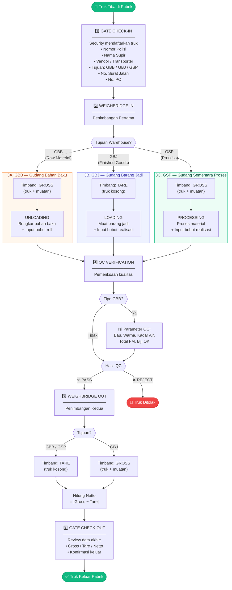
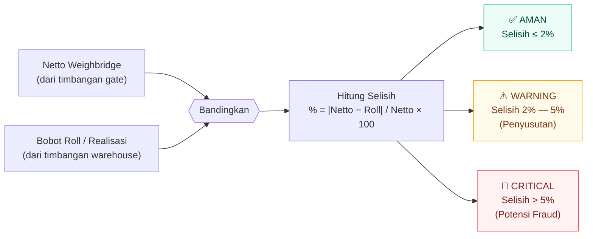
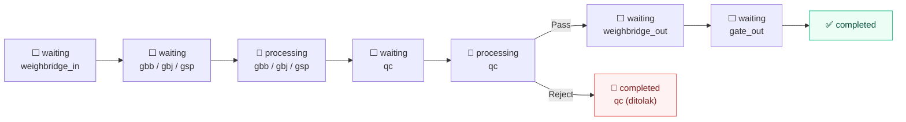

# 🏭 Flowchart Proses Bisnis — Gate Management System

## Alur Utama Truk di Pabrik

---

## Detail Penimbangan per Tipe

| Tahap | GBB (Bahan Baku) | GBJ (Barang Jadi) | GSP (Proses) |
|-------|-------------------|--------------------|--------------|
| **WB IN** | Gross *(berat truk + muatan)* | Tare *(berat truk kosong)* | Gross *(berat truk + muatan)* |
| **Warehouse** | Bongkar muatan (Unloading) | Muat barang (Loading) | Proses material |
| **WB OUT** | Tare *(berat truk kosong)* | Gross *(berat truk + muatan)* | Tare *(berat truk kosong)* |
| **Netto** | Gross − Tare | Gross − Tare | Gross − Tare |

---

## Fraud Detection (Rekonsiliasi Otomatis)

---

## Status Truk Sepanjang Proses

