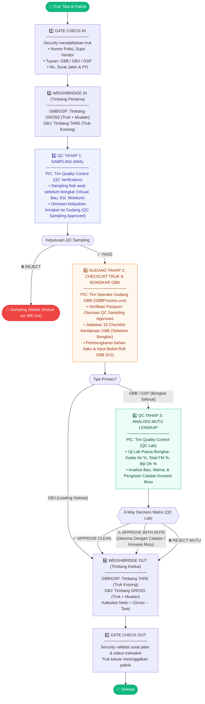
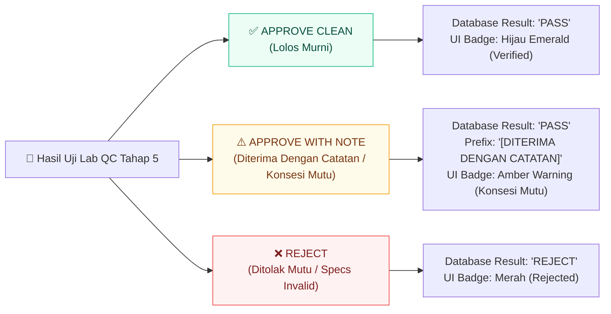

# 🏭 Flowchart Proses Bisnis — Gate Management System (v7.1 3-Stage QC & 10-Item GBB Checklist)

## Alur Utama Truk di Pabrik (GBB 7-Tahap Sequence)

---

## Pemisahan Tanggung Jawab (PIC) & Perbandingan Checklist Kendaraan

| Tahap Operasional | Modul UI | PIC | Fungsi Utama | Perincian Form / Items |
|---|---|---|---|---|
| **1. Gate Check-In** | `GateCheckIn.vue` | Security | Registrasi Data Masuk | Plat, Driver, Vendor, PO, Surat Jalan. |
| **2. Weighbridge IN** | `Weighbridge.vue` | Operator Timbangan | Timbang Gross / Tare | Timbang Gross (GBB/GSP). |
| **3. QC Sampling Awal** | `QCVerification.vue` | **Tim QC** | Sampling Fisik Awal | Form Sampling Awal (Visual Sampel, Bau Sampel, Estimasi Kadar Air %, Catatan Sampling). |
| **4. Checklist Truk & Bongkar GBB** | `GBBProcess.vue` | **Operator Gudang GBB** | Inspeksi Truk & Bongkar | **10 Checklist Kendaraan GBB** (hama, door seal, bau abnormal, susunan barang, kontaminan, kemasan, CoA, kesesuaian SJ, kebocoran, kebersihan) ➔ Input Timbangan Roll GBB (KG). |
| **5. QC Incoming Check** | `QCVerification.vue` | **Tim QC Lab** | Uji Mutu Lab Lengkap | Kadar Air %, Total FM %, Biji OK %, Bau, Warna + 3-Way Decision Bar (Approve / Approve with Note / Reject). |
| **6. Weighbridge OUT** | `Weighbridge.vue` | Operator Timbangan | Timbang Tare / Netto | Timbang Tare (Truk Kosong). |
| **7. Gate Check-Out** | `GateCheckOut.vue` | Security | Release Truk Keluar | Validasi Dokumen & Exit Factory. |

---

## 3-Way Industrial Decision Matrix (QC Lab Pasca-Bongkar)

