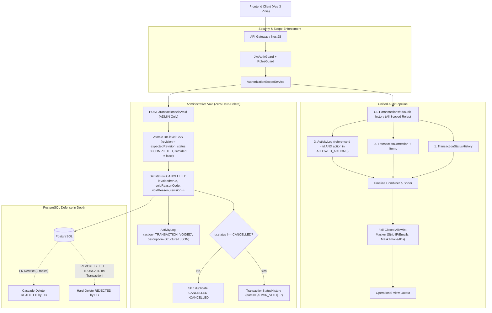

# Blueprint & Implementation Plan: Scoped Unified Audit History & Administrative Void Transaction (v2.1 - Approved)

> **Target Standard:** ISO/IEC 27001:2022 + Amd 1:2024, ISO/IEC 27002:2022  
> **Status:** APPROVED FOR EXECUTION WITH 4 FINAL AMENDMENTS ✅  
> **Production Baseline:** 8.8 / 10 | Target Post-Deployment Re-assessment: ≥ 9.3–9.5 / 10  
> **Architectural Objective:** Implement an immutable, role-scoped Unified Audit Timeline (Status Transitions, Operation Corrections, and Scoped Activity Logs with Fail-Closed PII Masking) and a hardened, atomic Compare-And-Swap (CAS) Administrative Void Transaction workflow (`POST /transactions/:id/void`), completely eliminating hard-delete mechanisms from application runtime and database privileges.

---

## Final Amendments Incorporated

| Amendment | Category | Final Approved Specification |
| :--- | :--- | :--- |
| 🔴 **P0** | **Legacy Data Backfill** | PostgreSQL migration runs targeted backfill on historical rows matching `status = 'CANCELLED'` and `cancellationReason ILIKE '%deleted via API%' OR '%soft-delete%'` setting `isVoided = true, voidReasonCode = 'LEGACY_SOFT_DELETE'`. Normal Security cancellations remain `isVoided = false`. |
| 🔴 **P0** | **Structured ActivityLog (Zero Raw Email)** | `description` passed to `ActivityLogsService.logAction` as structured JSON object `{ transactionNumber, plateNumber, originalStatus, reasonCode, reason, previousRevision, newRevision }`. Zero raw emails embedded in free-text descriptions. |
| 🟠 **P1** | **Deterministic Concurrency Test** | Test #07 strictly specifies: 2 simultaneous requests with same revision $\rightarrow$ **Exactly 1 × HTTP 200 and 1 × HTTP 409 Conflict**. Test #14 strictly specifies: subsequent request on already-voided tx $\rightarrow$ **HTTP 200 Idempotent**. |
| 🟠 **P1** | **No Pseudo Status Transitions** | If `tx.status === 'CANCELLED'`, skip creating `TransactionStatusHistory` row to avoid `CANCELLED -> CANCELLED`. Void audit is captured in `Transaction` metadata + `ActivityLog` (`TRANSACTION_VOIDED`). |
| 🟠 **P1** | **Action Allowlist for Unified Audit** | Scoped `ActivityLog` queries filtered by `ALLOWED_TRANSACTION_AUDIT_ACTIONS = ['TRANSACTION_CREATED', 'TRANSACTION_STATUS_CHANGED', 'TRANSACTION_CORRECTED', 'TRANSACTION_REOPENED', 'TRANSACTION_CANCELLED', 'TRANSACTION_VOIDED']`. |

---

## 1. ISO/IEC 27001:2022 & ISO/IEC 27002:2022 Control Mapping

| ISO 27002:2022 Control | Control Name | GMS Technical Implementation |
| :--- | :--- | :--- |
| **5.15** | Access Control | Role-based JWT authentication (`JwtAuthGuard` & `RolesGuard`). |
| **5.18** | Access Rights | Admin privileges segregated from QC, Warehouse, and Security. |
| **5.33** | Protection of Records | Immutability on `TransactionCorrection`, `TransactionStatusHistory`, `ActivityLog`. Triple FK `onDelete: Restrict`. |
| **5.34** | Privacy & Protection of PII | Fail-closed PII masking (`driverPhone`, `guestIdNumber`, `permitCardNumber` -> masked) on operational audit timeline. |
| **8.2** | Privileged Access Rights | `POST /void` and data correction restricted strictly to `ADMIN`. |
| **8.3** | Information Access Restriction | QC/Warehouse can only query audit timelines for transactions within their authorized `warehouseAccess` scopes (`GBB`, `GBJ`, `GSP`). |
| **8.10** | Information Deletion | Non-destructive logical Void (`isVoided=true`, `status=CANCELLED`), retaining all process records, weighing, and evidence attachments. |
| **8.11** | Data Masking | Internal system metadata (`ipAddress`, `userAgent`, admin emails, internal IDs) stripped from non-admin operational views. |
| **8.15** | Logging | Voiding records `TRANSACTION_VOIDED` in `ActivityLog` as structured JSON and creates `TransactionStatusHistory` entry atomically. |
| **8.16** | Monitoring Activities | Unified visual audit timeline available in UI for authorized operational inspection. |
| **8.29** | Security Testing in Development | 30-point regression test suite verifying RBAC, IDOR, PII masking, OCC CAS concurrency, and DB privilege restrictions. |
| **8.32** | Change Management | Explicit Prisma migration, schema drift checks, migration rehearsal, and static CI guards before production deploy. |

---

## 2. Target Architecture



---

## 3. Detailed File-by-File Blueprint

### Component 1: Database Schema & Migration Layer

#### [MODIFY] [schema.prisma](file:///d:/Data%20Kacong/Antigravity%20Project/Aplikasi%20Gate%20Management%20System/backend/prisma/schema.prisma)
- Add void tracking fields to `Transaction`:
  ```prisma
  isVoided              Boolean           @default(false)
  voidedAt              DateTime?
  voidedById            String?
  voidReasonCode        String?
  voidReason            String?

  voidedBy              User?             @relation("VoidedByUser", fields: [voidedById], references: [id], onDelete: SetNull)
  ```
- Add inverse relation to `User`:
  ```prisma
  voidedTransactions    Transaction[]     @relation("VoidedByUser")
  ```
- Set `onDelete: Restrict` on 3 audit relations:
  ```prisma
  // In TransactionStatusHistory:
  transaction Transaction @relation(fields: [transactionId], references: [id], onDelete: Restrict)

  // In TransactionCorrection:
  transaction Transaction @relation(fields: [transactionId], references: [id], onDelete: Restrict)

  // In TransactionCorrectionItem:
  correction TransactionCorrection @relation(fields: [correctionId], references: [id], onDelete: Restrict)
  ```

#### [NEW] [migration.sql](file:///d:/Data%20Kacong/Antigravity%20Project/Aplikasi%20Gate%20Management%20System/backend/prisma/migrations/20260821100000_void_metadata_and_fk_restrict/migration.sql)
```sql
-- AlterTable Transaction: Add void metadata fields
ALTER TABLE "Transaction" 
  ADD COLUMN "isVoided" BOOLEAN NOT NULL DEFAULT false,
  ADD COLUMN "voidedAt" TIMESTAMP(3),
  ADD COLUMN "voidedById" TEXT,
  ADD COLUMN "voidReasonCode" TEXT,
  ADD COLUMN "voidReason" TEXT;

-- Backfill legacy soft-deleted transactions
UPDATE "Transaction"
SET
  "isVoided" = true,
  "voidedAt" = COALESCE("cancelledAt", "updatedAt"),
  "voidedById" = "cancelledById",
  "voidReasonCode" = 'LEGACY_SOFT_DELETE',
  "voidReason" = COALESCE("cancellationReason", 'Migrated from legacy soft-delete')
WHERE
  "status" = 'CANCELLED'
  AND (
    "cancellationReason" ILIKE '%deleted via API%'
    OR "cancellationReason" ILIKE '%soft-delete%'
  );

-- AddForeignKey for voidedById
ALTER TABLE "Transaction" 
  ADD CONSTRAINT "Transaction_voidedById_fkey" 
  FOREIGN KEY ("voidedById") REFERENCES "User"("id") ON DELETE SET NULL ON UPDATE CASCADE;

-- Update 3 foreign keys to RESTRICT
ALTER TABLE "TransactionStatusHistory" 
  DROP CONSTRAINT "TransactionStatusHistory_transactionId_fkey",
  ADD CONSTRAINT "TransactionStatusHistory_transactionId_fkey" 
  FOREIGN KEY ("transactionId") REFERENCES "Transaction"("id") ON DELETE RESTRICT ON UPDATE CASCADE;

ALTER TABLE "TransactionCorrection" 
  DROP CONSTRAINT "TransactionCorrection_transactionId_fkey",
  ADD CONSTRAINT "TransactionCorrection_transactionId_fkey" 
  FOREIGN KEY ("transactionId") REFERENCES "Transaction"("id") ON DELETE RESTRICT ON UPDATE CASCADE;

ALTER TABLE "TransactionCorrectionItem" 
  DROP CONSTRAINT "TransactionCorrectionItem_correctionId_fkey",
  ADD CONSTRAINT "TransactionCorrectionItem_correctionId_fkey" 
  FOREIGN KEY ("correctionId") REFERENCES "TransactionCorrection"("id") ON DELETE RESTRICT ON UPDATE CASCADE;
```

#### [MODIFY] [enforce-audit-immutability.js](file:///d:/Data%20Kacong/Antigravity%20Project/Aplikasi%20Gate%20Management%20System/backend/scripts/enforce-audit-immutability.js)
- Explicitly revoke `DELETE` and `TRUNCATE` on `"Transaction"` for `gms_app`:
  ```javascript
  await prisma.$executeRawUnsafe(
    `REVOKE DELETE, TRUNCATE ON TABLE public."Transaction" FROM "${appUser}";`
  );
  ```

---

### Component 2: Backend Utilities & DTO Layer

#### [NEW] [mask-pii.util.ts](file:///d:/Data%20Kacong/Antigravity%20Project/Aplikasi%20Gate%20Management%20System/backend/src/common/utils/mask-pii.util.ts)
- Fail-closed masking functions:
  - `maskPhone(phone: string): string` -> `0812****789`
  - `maskIdCard(id: string): string` -> `********1234`
  - `maskPermitCard(card: string): string` -> `********9901`
  - `sanitizeAuditData(data: any, isAdmin: boolean): any` -> Fail-closed allowlist sanitizer that strips `ipAddress`, `userAgent`, admin emails, internal IDs, and masks PII fields for non-admin viewers.

#### [NEW] [void-transaction.dto.ts](file:///d:/Data%20Kacong/Antigravity%20Project/Aplikasi%20Gate%20Management%20System/backend/src/transactions/dto/void-transaction.dto.ts)
```typescript
import { IsEnum, IsInt, IsNotEmpty, IsString, MaxLength, Min, MinLength } from 'class-validator';
import { ApiProperty } from '@nestjs/swagger';

export enum VoidReasonCode {
  DUPLICATE_TRANSACTION = 'DUPLICATE_TRANSACTION',
  WRONG_REGISTRATION = 'WRONG_REGISTRATION',
  TEST_DATA = 'TEST_DATA',
  INVALID_TRANSACTION = 'INVALID_TRANSACTION',
  OPERATOR_INPUT_ERROR = 'OPERATOR_INPUT_ERROR',
  OTHER = 'OTHER',
}

export class VoidTransactionDto {
  @ApiProperty({ enum: VoidReasonCode, example: 'DUPLICATE_TRANSACTION' })
  @IsEnum(VoidReasonCode)
  @IsNotEmpty()
  reasonCode: VoidReasonCode;

  @ApiProperty({ example: 'Security salah input plat nomor ganda', minLength: 5, maxLength: 500 })
  @IsString()
  @IsNotEmpty()
  @MinLength(5)
  @MaxLength(500)
  reason: string;

  @ApiProperty({ example: 7, description: 'Expected revision number for atomic CAS' })
  @IsInt()
  @Min(1)
  expectedRevision: number;
}
```

#### [NEW] [unified-audit-history.dto.ts](file:///d:/Data%20Kacong/Antigravity%20Project/Aplikasi%20Gate%20Management%20System/backend/src/transactions/dto/unified-audit-history.dto.ts)
- Type definitions for unified timeline:
  - `STATUS_TRANSITION` (old status, new status, changedBy role/name, notes, timestamp)
  - `DATA_CORRECTION` (module, fieldName, oldValue [masked], newValue [masked], reasonCode, remark, correctedBy role/name, timestamp)
  - `WORKFLOW_REOPEN` (targetStatus, reasonCode, remark, reopenedBy role/name, timestamp)
  - `ADMIN_VOID` (reasonCode, reason, voidedBy role/name, originalStatus, timestamp)

---

### Component 3: Backend Controller & Service Layer

#### [MODIFY] [transactions.service.ts](file:///d:/Data%20Kacong/Antigravity%20Project/Aplikasi%20Gate%20Management%20System/backend/src/transactions/transactions.service.ts)
- Implement `voidTransaction(id: string, dto: VoidTransactionDto, user: JwtPayloadUser)`:
  1. Retrieve transaction by ID. If not found, throw `NotFoundException`.
  2. If `tx.status === 'COMPLETED'`, throw `BadRequestException` ("Transaksi berstatus COMPLETED tidak dapat di-void. Gunakan Koreksi Data Admin.").
  3. If `tx.isVoided === true`, return idempotent success (`message: 'Transaksi sudah di-void sebelumnya.'`).
  4. Perform atomic CAS update directly in database statement:
     ```typescript
     const updateRes = await prismaTx.transaction.updateMany({
       where: {
         id,
         revision: dto.expectedRevision,
         status: { not: 'COMPLETED' },
         isVoided: false,
       },
       data: {
         status: 'CANCELLED',
         isVoided: true,
         voidedAt: new Date(),
         voidedById: user.id,
         voidReasonCode: dto.reasonCode,
         voidReason: dto.reason,
         cancellationReason: `[VOID: ${dto.reasonCode}] ${dto.reason}`,
         cancelledAt: tx.cancelledAt || new Date(),
         cancelledById: tx.cancelledById || user.id,
         revision: { increment: 1 },
       },
     });
     if (updateRes.count !== 1) {
       throw new ConflictException(
         'Konflik Konkurensi: Data transaksi telah diubah oleh proses lain atau revisi tidak cocok. Silakan muat ulang data.',
       );
     }
     ```
  5. Conditional `TransactionStatusHistory` (avoid pseudo-transition if already CANCELLED):
     ```typescript
     if (tx.status !== 'CANCELLED') {
       await prismaTx.transactionStatusHistory.create({
         data: {
           transactionId: id,
           oldStatus: tx.status,
           newStatus: 'CANCELLED',
           changedById: user.id,
           notes: `[ADMIN_VOID] ${dto.reasonCode}: ${dto.reason}`,
         },
       });
     }
     ```
  6. Structured `ActivityLog` (Zero raw email in description):
     ```typescript
     await this.activityLogsService.logAction(
       {
         userId: user.id,
         action: 'TRANSACTION_VOIDED',
         module: 'TRANSACTIONS',
         referenceId: id,
         description: {
           transactionNumber: tx.transactionNumber,
           plateNumber: tx.plateNumber,
           originalStatus: tx.status,
           reasonCode: dto.reasonCode,
           reason: dto.reason,
           previousRevision: tx.revision,
           newRevision: tx.revision + 1,
         },
         status: 'SUCCESS',
       },
       prismaTx,
     );
     ```

#### [MODIFY] [transactions.controller.ts](file:///d:/Data%20Kacong/Antigravity%20Project/Aplikasi%20Gate%20Management%20System/backend/src/transactions/transactions.controller.ts)
- Replace `@Delete(':id')` with `@Post(':id/void')`:
  ```typescript
  @Post(':id/void')
  @Roles('ADMIN')
  @HttpCode(HttpStatus.OK)
  @ApiOperation({ summary: 'Administratively void a transaction (ADMIN only, Atomic CAS enforced)' })
  @ApiResponse({ status: 200, description: 'Transaction successfully voided' })
  @ApiResponse({ status: 400, description: 'Transaction is COMPLETED' })
  @ApiResponse({ status: 409, description: 'Concurrency Conflict - Revision mismatch' })
  voidTransaction(
    @Param('id') id: string,
    @Body() dto: VoidTransactionDto,
    @CurrentUser() user: JwtPayloadUser,
  ) {
    return this.transactionsService.voidTransaction(id, dto, user);
  }
  ```

#### [MODIFY] [operation-log-correction.controller.ts](file:///d:/Data%20Kacong/Antigravity%20Project/Aplikasi%20Gate%20Management%20System/backend/src/transactions/operation-log-correction.controller.ts)
- Keep `@Get(':id/operation-log-corrections')` strictly `@Roles('ADMIN')`.
- Add role-scoped unified audit timeline endpoint:
  ```typescript
  @Get(':id/audit-history')
  @Roles('ADMIN', 'SECURITY', 'QC', 'WAREHOUSE')
  @ApiOperation({ summary: 'Get unified, role-scoped, and sanitized transaction audit timeline' })
  getUnifiedAuditHistory(
    @Param('id') id: string,
    @CurrentUser() user: JwtPayloadUser,
  ) {
    return this.correctionService.getUnifiedAuditHistory(id, user);
  }
  ```

#### [MODIFY] [operation-log-correction.service.ts](file:///d:/Data%20Kacong/Antigravity%20Project/Aplikasi%20Gate%20Management%20System/backend/src/transactions/operation-log-correction.service.ts)
- Implement `getUnifiedAuditHistory(transactionId: string, user: JwtPayloadUser)`:
  1. Scope assertion: `const scope = this.authorizationScopeService.getTransactionScope(user)`.
  2. Query transaction with `where: { id: transactionId, ...scope }`. If not found, throw `NotFoundException` (IDOR defense).
  3. Query `statusHistory`, `corrections` (with items), and `activityLogs`:
     ```typescript
     const ALLOWED_TRANSACTION_AUDIT_ACTIONS = [
       'TRANSACTION_CREATED',
       'TRANSACTION_STATUS_CHANGED',
       'TRANSACTION_CORRECTED',
       'TRANSACTION_REOPENED',
       'TRANSACTION_CANCELLED',
       'TRANSACTION_VOIDED',
     ];
     const activities = await this.prisma.activityLog.findMany({
       where: {
         referenceId: transactionId,
         action: { in: ALLOWED_TRANSACTION_AUDIT_ACTIONS },
       },
     });
     ```
  4. Aggregate and sort timeline by timestamp ascending.
  5. Sanitize and mask data via `sanitizeAuditData`.

---

### Component 4: Static CI Guard & Verification Scripts

#### [NEW] [check-hard-delete-guard.js](file:///d:/Data%20Kacong/Antigravity%20Project/Aplikasi%20Gate%20Management%20System/scripts/check-hard-delete-guard.js)
- Static analysis script scanning `backend/src` for:
  - `prisma.transaction.delete`
  - `prisma.transaction.deleteMany`
  - `DELETE FROM "Transaction"` / `DELETE FROM public."Transaction"`
  - `TRUNCATE "Transaction"` / `TRUNCATE public."Transaction"`
  - `@Delete` route decorators in controllers
- Exits with code `1` if any forbidden pattern is detected.

#### [MODIFY] [verify-least-privilege.ps1](file:///d:/Data%20Kacong/Antigravity%20Project/Aplikasi%20Gate%20Management%20System/scripts/verify-least-privilege.ps1)
- Add negative tests verifying that role `gms_app` is denied `DELETE` and `TRUNCATE` on table `Transaction`.

---

### Component 5: Frontend UI & Copy Alignment

#### [MODIFY] [truckService.js](file:///d:/Data%20Kacong/Antigravity%20Project/Aplikasi%20Gate%20Management%20System/frontend/src/services/truckService.js)
- Replace `delete(id)` with `void(id, data)`:
  ```javascript
  void(id, data) {
    return api.post(`/transactions/${id}/void`, data)
  },
  getAuditHistory(id) {
    return api.get(`/transactions/${id}/audit-history`)
  }
  ```

#### [MODIFY] [truckStore.js](file:///d:/Data%20Kacong/Antigravity%20Project/Aplikasi%20Gate%20Management%20System/frontend/src/stores/truckStore.js)
- Implement `voidTruck(id, { reasonCode, reason, expectedRevision })`:
  - Calls `truckService.void`.
  - Updates local store state (`t.status = 'CANCELLED'`, `t.isVoided = true`).
  - Toast: `"Transaksi berhasil dibatalkan secara administratif (Void). Seluruh riwayat audit dan data tetap tersimpan."`.

#### [MODIFY] [TruckDetailsModal.vue](file:///d:/Data%20Kacong/Antigravity%20Project/Aplikasi%20Gate%20Management%20System/frontend/src/components/TruckDetailsModal.vue)
- Button label: **"Void Transaksi"** with subtext *"Mengeluarkan transaksi dari operasional tanpa menghapus data historis"*.
- Dialog modal captures `reasonCode` dropdown and `reason` text.
- Passes `expectedRevision: props.truck.revision`.
- Unified Audit Trail component displays timeline with distinct badges (`STATUS`, `CORRECTION`, `REOPEN`, `VOID`), visible to all scoped authenticated users (`isAdmin || isSecurity || isQc || isWarehouse`), with `ADMIN` retaining action buttons.

---

## 4. 30-Point Verification Matrix

| No | Verification Case | Input / Condition | Expected Output | Status |
| :--- | :--- | :--- | :--- | :--- |
| **01** | ADMIN void ACTIVE transaction | Valid payload, matching revision | HTTP 200, status `CANCELLED`, `isVoided=true` | ⏳ Pending |
| **02** | ADMIN void COMPLETED transaction | COMPLETED transaction | HTTP 400 Bad Request | ⏳ Pending |
| **03** | SECURITY role void attempt | Token role `SECURITY` | HTTP 403 Forbidden | ⏳ Pending |
| **04** | QC role void attempt | Token role `QC` | HTTP 403 Forbidden | ⏳ Pending |
| **05** | WAREHOUSE role void attempt | Token role `WAREHOUSE` | HTTP 403 Forbidden | ⏳ Pending |
| **06** | Stale revision void attempt | `expectedRevision` != `tx.revision` | HTTP 409 Conflict | ⏳ Pending |
| **07** | Simultaneous concurrent CAS void | 2 simultaneous requests with same rev | **Exactly 1 × HTTP 200 and 1 × HTTP 409** | ⏳ Pending |
| **08** | Transaction row retention | Query DB after void | Row exists, `status='CANCELLED'` | ⏳ Pending |
| **09** | Correction history retention | Query `TransactionCorrection` | 100% of rows preserved | ⏳ Pending |
| **10** | QC & Warehouse checks retention | Query checks tables | 100% of rows preserved | ⏳ Pending |
| **11** | Attachments retention | Query `Attachment` table | 100% of attachments preserved | ⏳ Pending |
| **12** | Normal Cancel vs Void distinction | Normal cancel via `/cancel` | `isVoided=false`, `voidedAt=null` | ⏳ Pending |
| **13** | CANCELLED then Voided | Void previously cancelled tx | `isVoided=true`, `voidReasonCode` saved | ⏳ Pending |
| **14** | Already voided retry | Void an already-voided tx | HTTP 200 Idempotent success | ⏳ Pending |
| **15** | ADMIN audit history read | Any transaction ID | HTTP 200 with complete audit trail | ⏳ Pending |
| **16** | SECURITY audit history read | Any active transaction ID | HTTP 200 with sanitized audit trail | ⏳ Pending |
| **17** | QC matching scope audit read | QC with `GBB` scope querying GBB tx | HTTP 200 with sanitized audit trail | ⏳ Pending |
| **18** | QC out-of-scope audit read | QC with `GBB` scope querying GBJ tx | HTTP 404 Not Found (IDOR defense) | ⏳ Pending |
| **19** | WAREHOUSE matching scope audit read | WH with `GBJ` scope querying GBJ tx | HTTP 200 with sanitized audit trail | ⏳ Pending |
| **20** | WAREHOUSE out-of-scope audit read | WH with `GBJ` scope querying GBB tx | HTTP 404 Not Found (IDOR defense) | ⏳ Pending |
| **21** | Raw admin email redacted | Non-admin query audit history | Field `email` omitted from response | ⏳ Pending |
| **22** | IP address redacted | Non-admin query audit history | Field `ipAddress` omitted from response | ⏳ Pending |
| **23** | User agent redacted | Non-admin query audit history | Field `userAgent` omitted from response | ⏳ Pending |
| **24** | Driver phone masked | Non-admin query audit history | `0812****789` | ⏳ Pending |
| **25** | Guest KTP/ID masked | Non-admin query audit history | `********1234` | ⏳ Pending |
| **26** | DB privilege: DELETE on Transaction | `gms_app` executes `DELETE FROM "Transaction"` | PostgreSQL ERROR: permission denied | ⏳ Pending |
| **27** | DB privilege: TRUNCATE on Transaction | `gms_app` executes `TRUNCATE "Transaction"` | PostgreSQL ERROR: permission denied | ⏳ Pending |
| **28** | Foreign key RESTRICT enforcement | Attempt hard-delete on parent tx | PostgreSQL foreign key violation | ⏳ Pending |
| **29** | Static CI guard: Prisma delete | Run `check-hard-delete-guard.js` | 0 occurrences found [PASS] | ⏳ Pending |
| **30** | Static CI guard: Raw SQL delete | Scan for raw SQL delete queries | 0 occurrences found [PASS] | ⏳ Pending |

---

## 5. Execution & Verification Gates

- [ ] Task 1: Database Schema, FK Restrict & Legacy Backfill Migration
- [ ] Task 2: PII Masking Utilities & Data Transfer Objects
- [ ] Task 3: Backend Services & Scoped Unified Audit Timeline
- [ ] Task 4: Static CI Hard-Delete Guard & DB Privilege Verification
- [ ] Task 5: Frontend UI & Copy Alignment
- [ ] Automated regression tests (30/30 test cases)
- [ ] Production Readiness independently re-assessed post-deployment (Target: ≥ 9.3–9.5/10)
