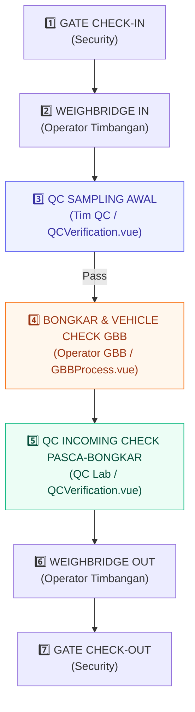

# 📄 Design Spec: GBB 7-Stage Workflow & 10-Item Vehicle Checklist Synchronization

## 1. Overview & Context

This design specification establishes the exact 7-stage operational workflow for GBB (*Gudang Bahan Baku*) transactions in the Gate Management System (GMS). It resolves previous role ambiguity between Quality Control (QC) and Warehouse Operators, ensuring strict Segregation of Duties (SoD), a clean 7-step sequence, clean UI label mappings, and zero database schema migration breakages.

---

## 2. The 7-Stage GBB Sequence & PIC Accountability

| Stage | Operational Step | User Interface | PIC | DB Status (`TransactionStatus`) | Action & Data Collected |
|---|---|---|---|---|---|
| **1** | **Gate Check-In** | `GateCheckIn.vue` | Security | `REGISTERED` | Plate, Driver, Vendor, PO, Surat Jalan registration. |
| **2** | **Weighbridge IN** | `Weighbridge.vue` | WB Operator | `WEIGH_IN_DONE` ➔ `QC_VEHICLE_PENDING` | Weighing Gross (Truck + Cargo). |
| **3** | **QC Sampling Awal** | `QCVerification.vue` | **Tim QC** | `QC_VEHICLE_PENDING` ➔ `QC_VEHICLE_PASSED` (UI Label: *QC Sampling Approved*) | **Sampling Awal Form** (Visual Sample, Odor, Moisture Estimate %, Notes). *No vehicle checklist here.* |
| **4** | **Checklist Truk & Bongkar GBB** | `GBBProcess.vue` | **Operator Gudang GBB** | `QC_VEHICLE_PASSED` ➔ `WAREHOUSE_IN_PROGRESS` ➔ `INCOMING_CHECK_PENDING` | **10-Item GBB Vehicle Checklist** (pre-unloading) ➔ Unload Cargo ➔ Input GBB Roll Weight (KG). |
| **5** | **QC Incoming Check Pasca-Bongkar** | `QCVerification.vue` | **Tim QC Lab** | `INCOMING_CHECK_PENDING` ➔ `INCOMING_CHECK_PASSED` / `REJECTED` | **Full Lab Analysis** (Moisture %, FM %, Bean OK %, Odor, Color, Notes/Concession) + 3-Way Decision Bar. |
| **6** | **Weighbridge OUT** | `Weighbridge.vue` | WB Operator | `WEIGH_OUT_DONE` | Weighing Tare (Empty Truck) & Netto Calculation. |
| **7** | **Gate Check-Out** | `GateCheckOut.vue` | Security | `COMPLETED` | Document verification & Truck exit. |

---

## 3. Detailed Component Specifications

### A. Stage 3: QC Sampling Awal (`QCVerification.vue`)
- **Trigger**: Truck status is `QC_VEHICLE_PENDING` or `QC_VEHICLE_IN_PROGRESS`.
- **UI Element**: Button `🧪 Input QC Sampling Awal (Pre-Unloading)`.
- **Modal Content**: Form Sampling Awal QC:
  - `Sample Visual`: Normal / Abnormal
  - `Sample Odor`: Normal / Abnormal
  - `Moisture Estimate (%)`: Number
  - `Sampling Notes`: Textarea
- **Actions**:
  - `Pass Sampling Awal`: Sets status to `QC_VEHICLE_PASSED` (UI Step Label: *QC Sampling Approved*).
  - `Reject Sampling`: Sets status to `QC_VEHICLE_REJECTED` (Redirected to WB Out).

### B. Stage 4: GBB Unloading & 10-Item Vehicle Inspection (`GBBProcess.vue`)
- **Trigger**: Truck status is `QC_VEHICLE_PASSED`.
- **UI Elements**:
  1. **Passport Authorization Card**: Visual banner stating *"Otorisasi QC Sampling Awal (Tahap 1) - APPROVED: Muatan berlisensi aman & layak untuk dibongkar di Gudang GBB"*.
  2. **10-Item Vehicle Checklist Button**: `📋 Run 10-Point Vehicle Inspection (Pre-Unloading)`.
- **Checklist Modal Items (10 GBB Poin)**:
  1. Vehicle is clean
  2. Vehicle door seal is intact
  3. Vehicle & goods have no abnormal odor
  4. Goods are neatly arranged
  5. No pests/animals or traces of living or dead animals found
  6. No foreign objects present
  7. Packaging is intact and complete
  8. CoA is available and matches batch
  9. Goods quantity matches delivery note
  10. Vehicle has no leaks / in good condition
- **Sequential Flow**:
  - Form Timbangan Roll GBB is **LOCKED** until all 10 checklist items are answered.
  - Upon completion, GBB Operator inputs GBB Roll Weight and submits unloading.
  - Status updates to `INCOMING_CHECK_PENDING`.

### C. Stage 5: QC Incoming Check Pasca-Bongkar (`QCVerification.vue`)
- **Trigger**: Truck status is `INCOMING_CHECK_PENDING` or `INCOMING_CHECK_IN_PROGRESS`.
- **UI Element**: Button `🔬 Input QC Analisis Mutu Lengkap (Post-Unloading)`.
- **Modal Content**: Full QC Lab Parameters (Moisture %, FM %, Bean OK %, Odor, Color, Concession Notes).
- **3-Way Decision Bar**:
  - ❌ **Reject**: `result: 'REJECT'` + Mandatory Notes.
  - ⚠️ **Approve with Note**: `result: 'PASS'` + Mandatory Notes + Prefix `[DITERIMA DENGAN CATATAN]`.
  - ✅ **Approve Clean**: `result: 'PASS'`.
- **Status Outcome**: Updates status to `INCOMING_CHECK_PASSED` or `INCOMING_CHECK_REJECTED`.

### D. Visual Timeline & Details (`StepTimeline.vue` & `TruckDetailsModal.vue`)
- **`StepTimeline.vue`**: Maps 7 sequence steps accurately with distinct labels (`QC Sampling Awal Approved`, `Bongkar GBB & Check`, `QC Lab Incoming Check`).
- **`TruckDetailsModal.vue`**: Renders QC Sampling Awal results, GBB 10-Item Vehicle Inspection results, GBB Roll Weights, QC Lab Results, and Amber Warning Badge (`⚠️ APPROVED WITH NOTE (KONSESI MUTU)`).

---

## 4. Security, DB Integrity & Performance

- **Prisma Schema Stability**: Uses existing `TransactionStatus` enums (`QC_VEHICLE_PASSED`, `INCOMING_CHECK_PASSED`, etc.) mapped semantically. No database migration needed.
- **Segregation of Duties (SoD)**: Backend NestJS guards prevent Warehouse role from executing QC endpoints and vice versa.
- **Zero-Error Rebuild Guarantee**: Clean typing and atomic transaction handling across `qc.service.ts`, `warehouse.service.ts`, and `weighbridge.service.ts`.
