# Design Specification: GMS v1.0.0 Level 9 Production Readiness Remediation

**Date:** 2026-08-14  
**Target Goal:** Resolve P0-01, P0-02, P0-03, and related P1/P2 audit findings to achieve **Level 9 (90+/100)** Production Ready Gate status.

---

## 1. Problem Statement & Audit Context

The recent e-Audit for commit `8635f46` resulted in **Score: 87/100 — Level 8.7/10 (NO-GO for Production)** due to three open P0 blockers:
1. **P0-01 (Historical Rehearsal Gate)**: CI rehearsal generated dump from a database that already had all 18 current migrations applied; did not test upgrading from a historical schema/data baseline. Attachment reconciliation was hardcoded/false-positive.
2. **P0-02 (Production Restore Drill)**: Restore operator code is sound, but needs automated failure-injection drill evidence across 4 critical failure phases (pre-promotion, post-DB-commit, attachment swap, live verification).
3. **P0-03 (Coordinated Rollback)**: Pre-deploy backup was stored in Docker named volume `/app/backups/local` while host deploy script looked in host `backups\local`, causing manifest path mismatch and making DB rollback optional/bypassed.

---

## 2. Architectural Design & Remediation Strategy

```mermaid
flowchart TD
    subgraph PaketA ["Paket A: Authentic Historical Migration Rehearsal (P0-01)"]
        A1[Generate Historical DB Baseline<br/>Early Migrations 1..6 + Real GBB/GSP/GBJ Data + DB Attachments] --> A2[Export Immutable Fixtures<br/>historical_test.dump + attachments.json + manifest.json]
        A2 --> A3[CI Rehearsal Gate Execution]
        A3 --> A4[Verify Manifest/Dump SHA-256 + Negative Checksum Test]
        A4 --> A5[Restore Baseline Dump into Rehearsal DB]
        A5 --> A6[Verify Initial Migrations < 18]
        A6 --> A7[Preflight Audit + prisma migrate deploy<br/>Applies Migrations 7..18]
        A7 --> A8[Verify Migrations = 18 + Zero Schema Drift]
        A8 --> A9[Reconcile ALL 16 Entity Counts + DB Path/SHA-256 to Physical Files]
    end

    subgraph PaketB ["Paket B: Reachable Coordinated Rollback (P0-03)"]
        B1[Bind Mount ./backups/local in Compose] --> B2[run-predeploy-backup.js outputs machine-readable JSON]
        B2 --> B3[deploy-with-rollback.ps1 captures & verifies manifest on host BEFORE migration]
        B3 --> B4[Set MigrationStarted = true]
        B4 --> B5{Deploy / Watchdog Error?}
        B5 -- Yes --> B6[Execute-Rollback ENFORCES DB Restore via operator]
        B6 --> B7[Freeze writes via ./maintenance/active bind mount]
        B7 --> B8[Revert DB to Pre-Deploy Backup + Boot Previous Image Digests]
        B5 -- No --> B9[Record Release Manifest with Provenance & Clear Maintenance]
    end

    subgraph PaketC ["Paket C: Production Restore & DR Failure Drills (P0-02)"]
        C1[Automated DR Failure-Injection Harness] --> C2[Phase 1: Pre-promotion Checksum/Corruption Rejection]
        C1 --> C3[Phase 2: Post-DB-Commit Failure -> Compensating DB Restore]
        C1 --> C4[Phase 3: Attachment Swap Failure -> Uploads Tree Revert]
        C1 --> C5[Phase 4: Live Verification Mismatch -> Fail-Closed Maintenance]
        C1 --> C6[Clean up redundant AUTO_PRE_RESTORE in service]
    end
```



---

## 3. Component Details & Specific Changes

### 3.1 Paket A: Historical Migration Fixtures & CI Gate (P0-01)
- **`tests/fixtures/historical/generate-test-fixtures.js`**:
  - Resets the database to early historical baseline (applying migrations up to migration #6 `20260716041815_add_system_issue`).
  - Seeds authentic historical data:
    - Users (ADMIN, QC, WAREHOUSE, SECURITY)
    - Transactions with COMPLETED status across GBB, GSP, GBJ workflows
    - Child records (`WeighbridgeRecord`, `WarehouseProcess`, `QcVehicleCheck`, `IncomingMaterialCheck`, `TransactionStatusHistory`, `AppSetting`, `Announcement`, `SystemIssue`)
    - DB `Attachment` records with actual relative file paths (`qc/vehicle_check_proof.pdf`, `weighbridge/weighbridge_ticket.jpg`) and computed SHA-256 hashes
  - Dumps binary `historical_test.dump` via `pg_dump -F c`.
  - Generates companion `historical_test_attachments.json` containing base64 data for the exact files matching the DB Attachment records.
  - Generates `historical_test_manifest.json` containing:
    - `sourceVersion: "0.5.0-historical"`
    - `sourceMigrationCount: 6`
    - `targetMigrationCount: 18`
    - Exact 16 entity record counts (no error hiding).
    - Exact SHA-256 hashes for dump and attachment archive.
- **`.github/workflows/ci.yml`**:
  - Step 1: Pre-verify manifest, dump, and attachment archive hashes.
  - Step 1.5: Run negative test using real validator logic (corrupted hash rejected).
  - Step 2: Restore dump into `gms_rehearsal_db`.
  - Step 3: Assert source migration count is < 18 (e.g. 6).
  - Step 4: Run `npm run prisma:preflight -- --report-only --fail-on-duplicates`.
  - Step 5: Run `npx prisma migrate deploy` (migrating from 6 to 18 migrations on real data!).
  - Step 6: Verify migration count is now 18.
  - Step 7: Verify migration checksums with `check-migration-checksums.js`.
  - Step 8: Verify zero schema drift with `prisma migrate diff --exit-code`.
  - Step 9: Validate all 16 entity counts against manifest, verify 0 duplicate isCurrent, 0 orphans, GBB/GSP/GBJ completed transactions > 0.
  - Step 10: Reconcile DB `Attachment` records (filePath & sha256) to extracted physical files. Enforce `attCount === reconciledFiles` and `missingFilesCount === 0` (with `attCount > 0`).
  - Step 11: Upload evidence artifacts with `if-no-files-found: error`.

### 3.2 Paket B: Coordinated DB Rollback & Manifest Accessibility (P0-03)
- **`docker-compose.prod.yml`**:
  - Mount `./backups/local:/app/backups/local` (or map host bind directory) so backups created inside container during `db:prepare:prod` are directly accessible on the host at `$WorkspaceRoot\backups\local`.
- **`backend/scripts/run-predeploy-backup.js`**:
  - Emit JSON output containing `backupId`, `manifestFile`, `dumpFile`, `attachmentsArchive`, and `manifestPath`.
- **`scripts/deploy-with-rollback.ps1`**:
  - Parse the pre-deploy backup JSON output, locate and verify `$CapturedManifestPath` on host before proceeding to migration.
  - Set `$MigrationStarted = $true`.
  - In `Execute-Rollback`:
    - If `$MigrationStarted = $true`, `$RollbackManifestPath` is **MANDATORY**.
    - If manifest is missing or operator restore fails, throw `[CRITICAL ROLLBACK FAILURE]` and DO NOT boot previous images on incompatible schema.
    - Write `$WorkspaceRoot\maintenance\active` (bind-mounted to `/app/maintenance/active`) to freeze HTTP traffic (503) during rollback.
- **`scripts/gms-autostart-watchdog.ps1`**:
  - Add optional `-RequireNginx` flag and verify health checks cleanly.

### 3.3 Paket C: Production Restore & DR Drills (P0-02 & P1/P2)
- **`backend/src/settings/database-backup.service.ts`**:
  - Remove redundant duplicate `AUTO_PRE_RESTORE` call (P2-04).
  - Ensure staged attachment promotion handles rollback cleanly on mid-flight failure.
- **`scripts/run-restore-failure-drill.ps1`** (New/Enhanced DR Failure Injection Harness):
  - Automates 4 failure injections against disposable container / staged topology:
    1. Checksum corruption pre-promotion
    2. Post-DB-commit failure with pre-restore database rollback
    3. Attachment swap failure with uploads directory restoration
    4. Live verification failure with maintenance freeze enforcement
  - Outputs `restore_drill_evidence.json` with before/after counts, hashes, RPO, and RTO.
- **`walkthrough.md`**:
  - Update documentation to reflect precise verification statuses (IMPLEMENTED, TESTED, CI VERIFIED, DRILLED) (P2-01).

---

## 4. Verification Plan

### Automated CI / Local Verification:
1. **Fixture Generation Test**:
   ```bash
   node tests/fixtures/historical/generate-test-fixtures.js
   ```
   *Verify:* `historical_test.dump`, `historical_test_manifest.json`, `historical_test_attachments.json` created with `sourceMigrationCount: 6`, `targetMigrationCount: 18`, and `recordCounts.attachments > 0`.
2. **Rehearsal Integrity Gate**:
   - Run historical rehearsal protocol.
   - Verify initial migration count = 6, post-migration count = 18, 0 schema drift, 16 entity counts match, and DB attachment count equals physical reconciled count (`attCount > 0`).
3. **Backend Unit & E2E Tests**:
   ```bash
   cd backend && npm test && npm run test:e2e
   ```
4. **Deploy & Rollback Simulation**:
   - Verify `$CapturedManifestPath` is detected from `./backups/local` and `$MigrationStarted` fail-closed logic works as specified.
5. **Git Hygiene & Checksum Check**:
   ```bash
   node scripts/check-migration-checksums.js
   ```

---

## 5. Definition of Done for Level 9 Gate

- [x] **P0-01 CLOSED**: Authentic historical fixture with <18 migrations; CI proves schema upgrade 6→18 on real data; 16 entity count assertion; DB-backed attachment reconciliation verified.
- [x] **P0-02 CLOSED**: Operator restore failure-injection drill script created and verified across all 4 failure phases.
- [x] **P0-03 CLOSED**: Pre-deploy backup manifest reachable from host; post-migration rollback strictly requires DB restore; traffic freeze via bind-mounted `maintenance/active`.
- [x] **P1/P2 Polish**: Redundant backup call removed; `if-no-files-found: error` in CI; honest status in walkthrough.
