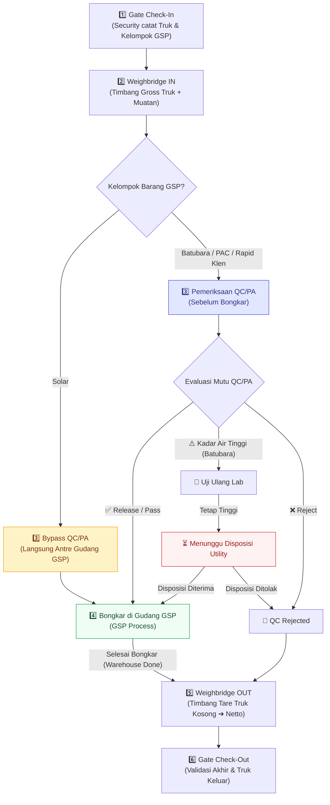

# DRAF SPESIFIKASI DESAIN: ALUR GSP 4 KELOMPOK BARANG & PEMERIKSAAN QC/PA (GMS)

- **Status Dokumen:** `DRAFT — USULAN TEKNIS MENUNGGU VERIFIKASI SOP RESMI`
- **Tanggal Draf:** 29 September 2026
- **Baseline Git:** Branch `fix/gsp-process-audit-improvements` (Commit `bf65603` berbasis `master` `ae0b30c`)
- **Lingkungan Target:** Khusus Lokal / UAT (Tidak untuk merge atau deploy ke produksi tanpa persetujuan formal)
- **Batasan Ruang Lingkup:** Dibatasi ketat hanya pada **4 Kelompok Barang** (Batubara, Solar, PAC 280 AC / POLYCOR P9 / IPAC CIP A200, Rapid Klen / PRO-CIP B++). Kelompok ke-5 (bahan kimia baris kelima) ditunda dan tidak dimasukkan ke dalam implementasi tahap ini.

---

## 1. Ringkasan Eksekutif & Prinsip Alur Operasional

Berdasarkan kesepakatan alur proses terbaru, keempat kelompok barang GSP memiliki karakteristik alur sebagai berikut:



### Prinsip Utama yang Disepakati:
1. **Semua 4 kelompok wajib Timbang Masuk (`grossWeight`) dan Timbang Keluar (`tareWeight`).**
2. **Solar melewati (bypass) tahap QC/PA:** langsung dari Timbang Masuk menuju Gudang GSP untuk bongkar.
3. **Tiga kelompok lainnya wajib lulus QC/PA sebelum bongkar:** QC/PA bertindak sebagai *gatekeeper* sebelum operator gudang diizinkan membongkar muatan.
4. **Penghapusan kewajiban Incoming Check pasca-bongkar untuk GSP:** Transaksi GSP setelah selesai bongkar gudang langsung berstatus `WAREHOUSE_DONE` menuju Timbang Keluar (tidak masuk ke `INCOMING_CHECK_PENDING` seperti bahan baku kopi GBB).

---

## 2. Matriks Alur & Transisi Status Backend

| Kelompok Barang | Status Awal | Setelah Timbang Masuk | Tahap QC/PA Pra-Bongkar | Status Siap Bongkar | Pasca-Bongkar Gudang | Status Akhir |
|---|---|---|---|---|---|---|
| **Batubara** | `REGISTERED` | `WEIGH_IN_DONE` | `QC_VEHICLE_PENDING` ➔ Uji Lab ➔ Status Antara bila deviasi ➔ `QC_VEHICLE_PASSED` | `WAREHOUSE_IN_PROGRESS` | `WAREHOUSE_DONE` | `WEIGH_OUT_DONE` ➔ `COMPLETED` |
| **Solar** | `REGISTERED` | `WEIGH_IN_DONE` | **BYPASS** (Tidak masuk antrean QC) | `WAREHOUSE_IN_PROGRESS` (Langsung) | `WAREHOUSE_DONE` | `WEIGH_OUT_DONE` ➔ `COMPLETED` |
| **PAC 280 AC / POLYCOR P9 / IPAC CIP A200** | `REGISTERED` | `WEIGH_IN_DONE` | `QC_VEHICLE_PENDING` ➔ Sensory & Chemical Analysis ➔ `QC_VEHICLE_PASSED` | `WAREHOUSE_IN_PROGRESS` | `WAREHOUSE_DONE` | `WEIGH_OUT_DONE` ➔ `COMPLETED` |
| **Rapid Klen / PRO-CIP B++** | `REGISTERED` | `WEIGH_IN_DONE` | `QC_VEHICLE_PENDING` ➔ Sensory & Chemical Analysis ➔ `QC_VEHICLE_PASSED` | `WAREHOUSE_IN_PROGRESS` | `WAREHOUSE_DONE` | `WEIGH_OUT_DONE` ➔ `COMPLETED` |

---

## 3. Rincian Usulan Parameter QC/PA per Lembar Kerja SOP

> *Catatan Verifikasi:* Seluruh angka dan metode di bawah ini disalin secara setia dari 3 lembar kerja Excel yang diberikan, dengan catatan rujukan dan koreksi standar teknis yang menunggu validasi laboratorium pabrik.

### A. Lembar 1: Batubara (Coal)
*Rujukan Dokumen: Sheet "Batu bara" — Bagian 1, 2, 3, dan Catatan*

1. **Parameter Analisis Visual (Sebelum Dumping):**
   - *Kondisi Batubara:* Spesifikasi `"Kering (Tidak Basah)"` [Metode: Visual Analysis]
   - *Warna Batubara:* Spesifikasi `"Hitam / Hitam Kecoklatan / Coklat"` [Metode: Visual Analysis]
   - *Level Rank:* Spesifikasi `"High Rank Coal / Medium Rank coal / Low Rank Coal"` [Metode: Visual Analysis]
   - *Kilap Batubara:* Spesifikasi `"Hitam Mengkilap / Hitam Kecoklatan / Mudah lapuk"` [Metode: Visual Analysis]
   - *Bahan Pengotor:* Spesifikasi `"Tidak ada kontaminasi batuan maupun tanah"` [Metode: Visual Analysis]

2. **Moisture Analysis (Metode: Digital Moisture Analyzer):**
   - Pilihan Kategori Kalori:
     - `Kalori >6000`: Batas Maks. **25%**
     - `Kalori 5600 - 6000`: Batas Maks. **33%**
   - Hasil Uji Kadar Air (%): Input numerik (contoh lembar: `23,60%`).

3. **Proximate Analysis (ASTM):**
   | Parameter Analisis | Teks Lembar SOP | Standar ASTM Resmi yang Terverifikasi | Nilai COA | Nilai Hasil (%) |
   |---|---|---|:---:|:---:|
   | A. Moisture in Analysis | `ASTM D 33302` | **ASTM D3302** *(Total Moisture)* / **ASTM D3173** *(Analysis Sample Moisture)* | 5,04 | 19,11% |
   | B. Ash Content | `ASTM D 3174-18` | **ASTM D3174** *(Ash in the Analysis Sample)* | 23,71 | 10,08% |
   | C. Volatile Matter | `ASTM D 3175-18` | **ASTM D3175** *(Volatile Matter in the Analysis Sample)* | 38,35 | 49,52% |
   | D. Fix Carbon by Difference | `ASTM D 03172-13` | **ASTM D3172** *(Standard Practice for Proximate Analysis)* | 32,90 | 21,29% |

4. **Koreksi Alur Status Antara (Berdasarkan Catatan Lembar SOP):**
   - *Catatan Asli SOP:* `"Jika Moisture Analysis melebihi standard maka harus dilakukan analisa ulang. Jika hasil pengulangan analisa masih diatas standard maka akan dilakukan disposisi oleh tim Utility."`
   - *Rancangan State Machine Khusus Batubara:*
     1. **Uji Awal (Initial Test):**
        - Jika Kadar Air $\le$ Standar ➔ Hasil: `RELEASE` ➔ Lanjut Bongkar (`QC_VEHICLE_PASSED`).
        - Jika Kadar Air $>$ Standar ➔ Hasil: `RETEST_REQUIRED` (Wajib Uji Ulang).
     2. **Uji Ulang (Retest):**
        - Analis QC menginput hasil uji ke-2.
        - Jika Uji Ulang $\le$ Standar ➔ `RELEASE` (dengan catatan uji ulang berhasil).
        - Jika Uji Ulang tetap $>$ Standar ➔ Status beralih ke `WAITING_UTILITY_DISPOSITION`.
     3. **Disposisi Tim Utility:**
        - User dengan role/kewenangan Utility (atau QC Supervisor) menginput disposisi:
          - `DISPOSITION_ACCEPTED`: Batubara diizinkan bongkar dengan catatan penyesuaian boiler.
          - `DISPOSITION_REJECTED`: Muatan ditolak keras (`QC_VEHICLE_REJECTED`).

---

### B. Lembar 2: PAC 280 AC / POLYCOR P9 / IPAC CIP A200
*Rujukan Dokumen: Sheet "PAC" — Bagian 1 Sensory dan Bagian 2 Chemical Analysis*

1. **Sensory Analysis (Metode: Visual Evaluation):**
   - *Visual:* Spesifikasi `"Kuning, Coklat Jernih"` ➔ Hasil: OK (Coklat Jernih) / Not OK
   - *Foreign Matters:* Spesifikasi `"Tidak ada kontaminasi"` ➔ Hasil: OK / Not OK
   - *Kemasan dan Label:* Spesifikasi `"Kemasan & label tidak rusak"` ➔ Hasil: OK / Not OK

2. **Chemical Analysis:**
   - *pH 1%:* Spesifikasi **3,5 – 5** [Metode: pH meter] (contoh lembar: `4,225`)
   - *Density / Specific Gravity:* Spesifikasi **1,170 – 1,260 gr/cm³** [Metode: Hydrometer] (contoh lembar: `1,25`)
   - *Aluminium Content (%):* Spesifikasi **Min. 9%** [Metode: Titrasi] (contoh lembar: `-`)

3. **Koreksi Terhadap Variasi Produk:**
   - *Catatan Penting:* Nilai spesifikasi di atas tercantum pada lembar berlabel `"PAC"`. Ketiga nama produk dalam kelompok ini (PAC 280 AC, POLYCOR P9, IPAC CIP A200) memiliki komposisi kimiawi berbeda. 
   - **Aturan Draf:** Nilai spesifikasi default lembar ini diterapkan untuk `PAC 280 AC`. Untuk `POLYCOR P9` dan `IPAC CIP A200`, sistem harus mengizinkan pembacaan parameter spesifikasi produk masing-masing atau input acuan COA yang fleksibel sebelum batas resmi disahkan oleh QC Pabrik.

---

### C. Lembar 3: Rapid Klen / PRO-CIP B++
*Rujukan Dokumen: Sheet "Rapid kleen" — Bagian 1 Sensory dan Bagian 2 Chemical Analysis*

1. **Sensory Analysis (Metode: Visual Evaluation):**
   - *Visual:* Spesifikasi `"Jernih"` ➔ Hasil: OK / Not OK
   - *Foreign Matters:* Spesifikasi `"Tidak ada kontaminasi"` ➔ Hasil: OK / Not OK
   - *Kemasan dan Label:* Spesifikasi `"Kemasan & label tidak rusak"` ➔ Hasil: OK / Not OK

2. **Chemical Analysis:**
   - *% Alkalinity (Na2O):* Spesifikasi **> 35,00 %** [Metode: Titrasi] (contoh lembar: `37,63%`)
   - *% Alkalinity (NaOH):* Spesifikasi **> 45,16 %** [Metode: Titrasi] (contoh lembar: `48,55%`)
   - *pH 1%:* Spesifikasi **> 12,000** [Metode: pH meter] (contoh lembar: `12,653`)
   - *Density:* Spesifikasi **> 1,400 gr/cm³** [Metode: Hydrometer] (contoh lembar: `1,498 gr/cm³`)

3. **Koreksi Terhadap Variasi Produk:**
   - *Catatan Penting:* Lembar ini bertajuk `"Rapid kleen"`. Produk `PRO-CIP B++` mungkin memiliki konsentrasi dan batas alkalinitas berbeda. Konfigurasi batas harus terikat pada master data produk spesifik, bukan disamaratakan tanpa verifikasi SOP.

---

## 4. Evaluasi Opsi Model Data QC/PA Analysis

Menindaklanjuti arahan bahwa kolom `QcVehicleCheck.checklistItems` saat ini ditujukan untuk pemeriksaan fisik kendaraan, berikut adalah perbandingan 3 opsi arsitektur data:

| Kriteria Evaluasi | Opsi A: Tabel Baru `QcProductAnalysis` | Opsi B: Alihkan `IncomingMaterialCheck` | Opsi C: Skema JSON `QcVehicleCheck.checklistItems` |
|---|---|---|---|
| **Deskripsi** | Membuat tabel relasional baru khusus pengujian laboratorium produk (termasuk multi-round retest, COA, dan disposisi). | Menggunakan tabel `IncomingMaterialCheck` yang sudah ada, namun dijalankan di awal (pra-bongkar) untuk GSP. | Menyimpan seluruh hasil pengujian dan log retest dalam format JSON terstruktur pada tabel `QcVehicleCheck`. |
| **Separation of Concerns** | **Sangat Baik**: Terpisah tegas antara inspeksi armada truk dan analisis kimia/laboratorium. | **Cukup**: Mencampur konsep bahan baku kopi GBB dengan bahan kimia/energi GSP. | **Kurang**: Menggabungkan data kendaraan fisik dengan uji lab mineral/kimia. |
| **Dukungan Retest & Disposisi** | **Sangat Fleksibel**: Dapat menyimpan relasi `iteration: 1 (Initial)`, `iteration: 2 (Retest)`, serta kolom `dispositionBy`, `dispositionNotes`. | **Terbatas**: Skema tabel sudah memiliki kolom kaku untuk kopi (`moisture`, `foreignMatter`, `beanCondition`). | **Sedang**: Bisa disimpan di JSON, namun pencarian data dan validasi schema di tingkat DB lebih lemah. |
| **Dampak Migrasi Database** | Memerlukan Prisma migration baru (`ProductAssuranceCheck`). | Memerlukan penyesuaian enum dan relasi waktu tanpa tabel baru. | **Nol migrasi**: Kolom JSON sudah ada dan siap dipakai di lokal/UAT saat ini. |
| **Rekomendasi Dokumen** | **Rekomendasi Jangka Panjang (Produksi)** | Tidak direkomendasikan karena semantik kolom tidak sesuai | **Rekomendasi Fase Uji Coba Cepat (Lokal/UAT)** |

### Usulan Skema Opsi A (Tabel Baru):
```prisma
model QcProductAnalysis {
  id                    String        @id @default(uuid())
  transactionId         String
  testRound             Int           @default(1) // 1: Uji Awal, 2: Retest
  analysisType          String        // BATUBARA | PAC | RAPID_KLEN
  parameters            Json          // Nilai COA, Standar, Hasil Uji
  result                QcResult      // PASS | REJECT
  status                String        // RELEASED | RETEST_REQUIRED | WAITING_DISPOSITION | REJECTED
  dispositionRole       String?       // UTILITY | QC_SUPERVISOR
  dispositionNotes      String?
  dispositionAt         DateTime?
  testedById            String?
  testedAt              DateTime      @default(now())

  transaction           Transaction   @relation(fields: [transactionId], references: [id], onDelete: Cascade)
  testedBy              User?         @relation(fields: [testedById], references: [id], onDelete: SetNull)

  @@index([transactionId])
}
```

---

## 5. Rancangan Perubahan Backend & State Machine

### A. State Machine (`backend/src/common/state-machine/workflow-state-machine.ts`)
1. Menambahkan transisi yang sah dari `WEIGH_IN_DONE` langsung ke `WAREHOUSE_IN_PROGRESS`:
   ```typescript
   WEIGH_IN_DONE: [
     TransactionStatus.QC_VEHICLE_PENDING,
     TransactionStatus.WAREHOUSE_IN_PROGRESS, // Khusus Solar (Bypass QC)
     TransactionStatus.CANCELLED,
   ],
   ```
2. Menjamin transisi `WAREHOUSE_IN_PROGRESS` ke `WAREHOUSE_DONE` berlaku untuk proses gudang GSP:
   ```typescript
   WAREHOUSE_IN_PROGRESS: [
     TransactionStatus.INCOMING_CHECK_PENDING, // Khusus GBB
     TransactionStatus.WAREHOUSE_DONE,        // Khusus GBJ dan GSP
     TransactionStatus.CANCELLED,
   ],
   ```

### B. Layanan Timbangan (`backend/src/weighbridge/weighbridge.service.ts`)
Pada saat operator menyelesaikan Timbang Masuk (`recordWeighIn`):
```typescript
let nextStatus: TransactionStatus;
if (tx.processType === 'GSP' && tx.cargoSubType === 'Solar') {
  nextStatus = TransactionStatus.WAREHOUSE_IN_PROGRESS; // Bypass QC/PA
} else if (tx.processType === 'GBJ') {
  nextStatus = TransactionStatus.QC_VEHICLE_PENDING;
} else {
  nextStatus = TransactionStatus.QC_VEHICLE_PENDING;
}
```

### C. Layanan Gudang (`backend/src/warehouse/warehouse.service.ts`)
Pada saat operator gudang menyelesaikan proses bongkar (`completeWarehouse`):
```typescript
// Baris 465-469 yang sebelumnya mengarahkan GBB & GSP ke INCOMING_CHECK_PENDING:
let nextStatus: TransactionStatus;
if (tx.processType === 'GBB') {
  nextStatus = TransactionStatus.INCOMING_CHECK_PENDING; // GBB tetap alur 7-tahap
} else {
  nextStatus = TransactionStatus.WAREHOUSE_DONE;         // GBJ dan GSP langsung selesai gudang
}
```

### D. Penyelarasan Frontend (`GSPProcess.vue`)
Tombol mulai bongkar gudang disesuaikan agar aktif pada kondisi:
- Truk dengan status `QC_VEHICLE_PASSED` (untuk Batubara, PAC, Rapid Klen), **ATAU**
- Truk dengan status `WEIGH_IN_DONE` khusus `cargoSubType === 'Solar'`.

---

## 6. Daftar Keputusan yang Masih Terbuka (Open Decisions)

Sebelum draf ini disahkan menjadi rencana implementasi, pemilik proses (QC/PA, Utility, Gudang) perlu memberikan konfirmasi formal atas 4 poin ini:

1. **Pemilihan Model Data Database:**
   - Apakah untuk pengujian lokal/UAT tahap ini diizinkan membuat tabel migrasi baru (`QcProductAnalysis`), ataukah sementara menggunakan skema JSON terstruktur pada tabel yang ada agar tidak mengubah skema DB?
2. **Konfirmasi Rujukan Standar ASTM Laboratorium:**
   - Konfirmasi apakah laboratorium pabrik menggunakan **ASTM D3302** (Total Moisture) atau **ASTM D3173** (Analysis Sample Moisture), dan penulisan standar proximate **ASTM D3172**.
3. **Spesifikasi Spesifik per Varian Produk:**
   - Penyediaan batas spesifikasi resmi untuk:
     - `POLYCOR P9` vs `PAC 280 AC` vs `IPAC CIP A200`.
     - `PRO-CIP B++` vs `Rapid Klen`.
4. **Alur Otorisasi Disposisi Utility:**
   - Siapa PIC / akun yang berwenang menekan tombol "Disposisi Diterima" pada sistem saat batubara memiliki kadar air di atas standar (apakah akun dengan role khusus Utility, atau cukup Supervisor QC)?
