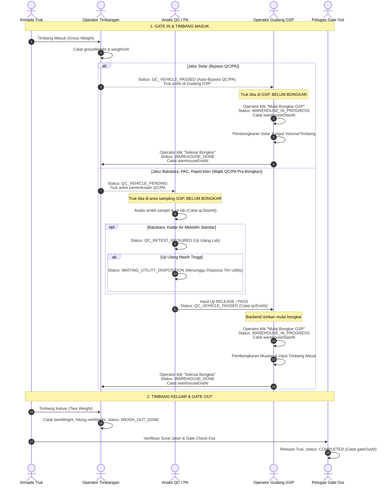

# DRAF SPESIFIKASI DESAIN: ALUR GSP 4 KELOMPOK BARANG & PEMERIKSAAN QC/PA (GMS)

- **Status Dokumen:** `DRAFT REVISI 2 — USULAN TEKNIS MENUNGGU VERIFIKASI SOP RESMI`
- **Tanggal Draf:** 29 September 2026
- **Baseline Git:** Branch `fix/gsp-process-audit-improvements` (Commit `c97a4cd` berbasis `master` `ae0b30c`)
- **Lingkungan Target:** Khusus Lokal / UAT (Tidak untuk merge atau deploy ke produksi tanpa persetujuan formal)
- **Batasan Ruang Lingkup:** Dibatasi ketat hanya pada **4 Kelompok Barang** (Batubara, Solar, PAC 280 AC / POLYCOR P9 / IPAC CIP A200, Rapid Klen / PRO-CIP B++). Kelompok ke-5 (bahan kimia baris kelima) ditunda dan tidak dimasukkan ke dalam implementasi tahap ini.

---

## 1. Pembedaan Tegas Tahap Waktu & Status Operasional

Berdasarkan penelusuran terhadap kode aktual `master` (`weighbridge.service.ts` dan `warehouse.service.ts`):
1. **Status Pasca Timbang Masuk:** Kode aktual saat ini menetapkan status `QC_VEHICLE_PENDING` setelah timbang masuk selesai (bukan `WEIGH_IN_DONE`).
2. **Semantik `WAREHOUSE_IN_PROGRESS`:** Status ini dan timestamp `warehouseStartAt` secara semantik menandakan bahwa proses fisik pembongkaran barang di gudang **telah benar-benar dimulai**. Memakai status ini untuk merepresentasikan armada yang baru tiba/antre di GSP sebelum pemeriksaan QC/PA adalah kekeliruan yang akan membuat waktu mulai bongkar tercatat terlalu awal (*premature timestamping*).

Oleh karena itu, alur operasional di area GSP dipisahkan secara tegas menjadi 3 sub-tahap:



---

## 2. Matriks Transisi Status, Penjagaan API, dan Rekam Waktu

Berikut adalah perbandingan rinci untuk masing-masing kelompok barang:

| Kelompok Barang | Status Pasca Timbang Masuk | Penjagaan API Pra-Bongkar (*Pre-Unloading Guard*) | Aksi Mulai Bongkar Gudang | Status & Waktu Bongkar | Alur Pasca-Bongkar Gudang |
|---|---|---|---|---|---|
| **Solar** | `QC_VEHICLE_PASSED` *(Bypass QC/PA otomatis tercatat pada Timbang Masuk)* | `startWarehouse` memverifikasi status `QC_VEHICLE_PASSED` dan jenis muatan `Solar`. Tidak ada blokir QC. | Operator GSP menekan **"Mulai Proses GSP"** saat pembongkaran solar dimulai fisik. | Status beralih ke `WAREHOUSE_IN_PROGRESS`. `warehouseStartAt` dicatat akurat saat tombol ditekan. | Selesai bongkar ➔ `WAREHOUSE_DONE` (`warehouseEndAt`). Langsung menuju Timbang Keluar (`WEIGH_OUT_DONE`). Tidak ada incoming check! |
| **Batubara** | `QC_VEHICLE_PENDING` | `startWarehouse` **memblokir keras** (HTTP 400) bila status transaksi belum `QC_VEHICLE_PASSED`. Menahan armada selama uji awal, uji ulang, atau menunggu disposisi Utility. | Operator GSP hanya dapat menekan **"Mulai Proses GSP"** setelah terbit keputusan `RELEASE` / `QC_VEHICLE_PASSED`. | Status beralih ke `WAREHOUSE_IN_PROGRESS`. `warehouseStartAt` dicatat akurat saat tombol ditekan. | Selesai bongkar ➔ `WAREHOUSE_DONE` (`warehouseEndAt`). Langsung menuju Timbang Keluar (`WEIGH_OUT_DONE`). |
| **PAC 280 AC / POLYCOR P9 / IPAC CIP A200** | `QC_VEHICLE_PENDING` | `startWarehouse` **memblokir keras** (HTTP 400) bila status transaksi belum `QC_VEHICLE_PASSED`. | Operator GSP menekan **"Mulai Proses GSP"** setelah evaluasi Sensory & Chemical Analysis `RELEASE`. | Status beralih ke `WAREHOUSE_IN_PROGRESS`. `warehouseStartAt` dicatat akurat saat tombol ditekan. | Selesai bongkar ➔ `WAREHOUSE_DONE` (`warehouseEndAt`). Langsung menuju Timbang Keluar (`WEIGH_OUT_DONE`). |
| **Rapid Klen / PRO-CIP B++** | `QC_VEHICLE_PENDING` | `startWarehouse` **memblokir keras** (HTTP 400) bila status transaksi belum `QC_VEHICLE_PASSED`. | Operator GSP menekan **"Mulai Proses GSP"** setelah evaluasi Sensory & Chemical Analysis `RELEASE`. | Status beralih ke `WAREHOUSE_IN_PROGRESS`. `warehouseStartAt` dicatat akurat saat tombol ditekan. | Selesai bongkar ➔ `WAREHOUSE_DONE` (`warehouseEndAt`). Langsung menuju Timbang Keluar (`WEIGH_OUT_DONE`). |

---

## 3. Penjagaan API & Arsitektur State Machine Backend

### A. Penyelarasan Layanan Timbangan Masuk (`weighbridge.service.ts`)
Pada saat fungsi `recordWeighIn` dipanggil:
```typescript
let grossWeight: number | null = dto.weight;
let tareWeight: number | null = null;
let nextStatus: TransactionStatus;

if (tx.processType === 'GSP' && tx.cargoSubType === 'Solar') {
  // Jalur khusus Solar: Bypass QC/PA secara resmi dan terverifikasi di backend
  nextStatus = TransactionStatus.QC_VEHICLE_PASSED;
} else if (tx.processType === 'GBB' || tx.processType === 'GSP') {
  // GBB dan GSP non-Solar: Wajib menuju antrean QC
  nextStatus = TransactionStatus.QC_VEHICLE_PENDING;
} else if (tx.processType === 'GBJ') {
  tareWeight = dto.weight;
  grossWeight = null;
  nextStatus = TransactionStatus.QC_VEHICLE_PENDING;
}
```

*Audit Trail Catatan Otomatis untuk Solar:*
Ketika Solar ditetapkan ke `QC_VEHICLE_PASSED`, sistem otomatis mencatat `ActivityLog` bertipe `QC_BYPASS_AUTHORIZED` dengan deskripsi `"SOP Exemption: Solar fuel delivery is exempt from laboratory PA analysis. Ready for warehouse unloading."`

### B. Penjagaan Mulai Bongkar Gudang (`warehouse.service.ts`)
Fungsi `startWarehouse` menjaga agar proses bongkar tidak dapat dimanipulasi:
```typescript
// Validasi status prasyarat:
if (tx.status !== TransactionStatus.QC_VEHICLE_PASSED) {
  throw new BadRequestException({
    success: false,
    message: `Gudang tidak dapat memulai bongkar: Transaksi harus berstatus QC_VEHICLE_PASSED (status saat ini: ${tx.status}).`,
    errors: [],
  });
}

// Atomic update status dan pencatatan warehouseStartAt:
const claimed = await prismaTx.transaction.updateMany({
  where: {
    id: transactionId,
    status: TransactionStatus.QC_VEHICLE_PASSED,
    revision: tx.revision,
  },
  data: {
    revision: { increment: 1 },
    status: TransactionStatus.WAREHOUSE_IN_PROGRESS,
    warehouseStartAt: new Date(), // Dicatat akurat tepat saat tombol diklik
    warehouseStartById: user.id,
    ...(dto.suratJalanNumber && { suratJalanNumber: dto.suratJalanNumber }),
    ...(dto.poNumber && { poNumber: dto.poNumber }),
  },
});
```

### C. Penjagaan Selesai Bongkar Gudang (`warehouse.service.ts`)
Fungsi `completeWarehouse` menghapus kewajiban Incoming Check pasca-bongkar untuk GSP tanpa mengganggu alur 7-tahap GBB:
```typescript
let nextStatus: TransactionStatus;
if (tx.processType === 'GBB') {
  // Komoditas bahan baku biji kopi GBB tetap wajib Uji Mutu Lab Pasca-Bongkar
  nextStatus = TransactionStatus.INCOMING_CHECK_PENDING;
} else {
  // GSP (dan GBJ) langsung menyelesaikan proses gudang dan menuju timbangan keluar
  nextStatus = TransactionStatus.WAREHOUSE_DONE;
}
```

---

## 4. Rincian Usulan Parameter QC/PA Sesuai Lembar Kerja SOP

### A. Lembar 1: Batubara (Sheet "Batu bara")
*Rujukan: Lembar Excel "Batu bara" — Bagian 1, 2, 3, dan Baris Noted*

1. **Parameter Analisis Visual (Pra-Dumping):**
   - *Kondisi Batubara:* Spesifikasi `"Kering (Tidak Basah)"` [Metode: Visual Analysis]
   - *Warna Batubara:* Spesifikasi `"Hitam / Hitam Kecoklatan / Coklat"` [Metode: Visual Analysis]
   - *Level Rank:* Spesifikasi `"High Rank Coal / Medium Rank coal / Low Rank Coal"` [Metode: Visual Analysis]
   - *Kilap Batubara:* Spesifikasi `"Hitam Mengkilap / Hitam Kecoklatan / Mudah lapuk"` [Metode: Visual Analysis]
   - *Bahan Pengotor:* Spesifikasi `"Tidak ada kontaminasi batuan maupun tanah"` [Metode: Visual Analysis]

2. **Moisture Analysis (Digital Moisture Analyzer):**
   - Pilihan Kategori Kalori:
     - `Kalori >6000`: Batas Maks. **25%**
     - `Kalori 5600 - 6000`: Batas Maks. **33%**
   - Hasil Uji Kadar Air (%): Input numerik (contoh lembar: `23,60%`).

3. **Proximate Analysis:**
   - **Teks Lembar SOP:** `ASTM D 33302` ➔ *Verifikasi Standar Resmi:* Terindikasi salah ketik dari **ASTM D3302** *(Standard Test Method for Total Moisture in Coal)* atau **ASTM D3173** *(Moisture in the Analysis Sample of Coal and Coke)*.
   - **Ash Content:** `ASTM D 3174-18` *(Standard Test Method for Ash in the Analysis Sample of Coal and Coke)*.
   - **Volatile Matter:** `ASTM D 3175-18` *(Standard Test Method for Volatile Matter in the Analysis Sample of Coal and Coke)*.
   - **Teks Lembar SOP:** `ASTM D 03172-13` ➔ *Verifikasi Standar Resmi:* Format baku ASTM adalah **ASTM D3172** *(Standard Practice for Proximate Analysis of Coal and Coke)* yang mencakup perhitungan *Fixed Carbon by Difference*.

4. **Alur Status Antara Khusus Batubara (Berdasarkan Catatan SOP):**
   ```mermaid
   flowchart TD
       START_TEST["Uji Kadar Air Awal (Round 1)"] --> CHECK{{"Hasil vs Standar Kalori"}}
       CHECK -->|"≤ Batas Maksimal"| PASS_INIT["✅ RELEASE (Lolos)"]
       CHECK -->|"> Batas Maksimal"| RETEST["🔄 Uji Ulang Lab (Round 2)"]
       
       RETEST --> CHECK_RETEST{{"Hasil Uji Ulang"}}
       CHECK_RETEST -->|"≤ Batas Maksimal"| PASS_RETEST["✅ RELEASE (Lolos Uji Ulang)"]
       CHECK_RETEST -->|"> Batas Maksimal"| WAIT_DISPO["⏳ WAITING_UTILITY_DISPOSITION<br/>(Menunggu Disposisi Tim Utility)"]
       
       WAIT_DISPO --> DECISION_DISPO{{"Keputusan Tim Utility"}}
       DECISION_DISPO -->|"Disposisi Diterima (Dispensasi)"| PASS_DISPO["✅ RELEASE WITH DISPOSITION<br/>(Otorisasi Utility Tercatat)"]
       DECISION_DISPO -->|"Disposisi Ditolak"| REJECT["❌ REJECT<br/>(Ditolak Keluar Pabrik)"]

       style PASS_INIT fill:#f0fdf4,stroke:#16a34a,color:#14532d
       style PASS_RETEST fill:#f0fdf4,stroke:#16a34a,color:#14532d
       style PASS_DISPO fill:#fef3c7,stroke:#f59e0b,color:#78350f
       style REJECT fill:#fef2f2,stroke:#ef4444,color:#7f1d1d
       style WAIT_DISPO fill:#fdf2f8,stroke:#db2777,color:#831843
   ```

---

### B. Lembar 2: PAC 280 AC / POLYCOR P9 / IPAC CIP A200 (Sheet "PAC")
*Rujukan: Lembar Excel "PAC" — Bagian 1 Sensory dan Bagian 2 Chemical Analysis*

1. **Sensory Analysis (Visual Evaluation):**
   - *Visual:* Spesifikasi `"Kuning, Coklat Jernih"` ➔ Hasil: OK (Coklat Jernih) / Not OK
   - *Foreign Matters:* Spesifikasi `"Tidak ada kontaminasi"` ➔ Hasil: OK / Not OK
   - *Kemasan dan Label:* Spesifikasi `"Kemasan & label tidak rusak"` ➔ Hasil: OK / Not OK

2. **Chemical Analysis:**
   - *pH 1%:* Spesifikasi **3,5 – 5,0** [Metode: pH meter] (contoh lembar: `4,225`)
   - *Density / Specific Gravity:* Spesifikasi **1,170 – 1,260 gr/cm³** [Metode: Hydrometer] (contoh lembar: `1,250`)
   - *Aluminium Content (%):* Spesifikasi **Min. 9%** [Metode: Titrasi] (contoh lembar: `-`)

3. **Prinsip Keterikatan Batas Uji terhadap Produk:**
   - Nilai spesifikasi pada lembar ini berlaku sebagai default untuk produk `PAC 280 AC`.
   - Produk `POLYCOR P9` dan `IPAC CIP A200` tidak boleh disamaratakan sebelum ada dokumen SOP spesifik untuk masing-masing merek; sistem menyediakan kemampuan mengikat batas spesifikasi ke master produk atau acuan COA resmi.

---

### C. Lembar 3: Rapid Klen / PRO-CIP B++ (Sheet "Rapid kleen")
*Rujukan: Lembar Excel "Rapid kleen" — Bagian 1 Sensory dan Bagian 2 Chemical Analysis*

1. **Sensory Analysis (Visual Evaluation):**
   - *Visual:* Spesifikasi `"Jernih"` ➔ Hasil: OK / Not OK
   - *Foreign Matters:* Spesifikasi `"Tidak ada kontaminasi"` ➔ Hasil: OK / Not OK
   - *Kemasan dan Label:* Spesifikasi `"Kemasan & label tidak rusak"` ➔ Hasil: OK / Not OK

2. **Chemical Analysis:**
   - *% Alkalinity (Na2O):* Spesifikasi **> 35,00 %** [Metode: Titrasi] (contoh lembar: `37,63%`)
   - *% Alkalinity (NaOH):* Spesifikasi **> 45,16 %** [Metode: Titrasi] (contoh lembar: `48,55%`)
   - *pH 1%:* Spesifikasi **> 12,000** [Metode: pH meter] (contoh lembar: `12,653`)
   - *Density:* Spesifikasi **> 1,400 gr/cm³** [Metode: Hydrometer] (contoh lembar: `1,498 gr/cm³`)

3. **Prinsip Keterikatan Batas Uji terhadap Produk:**
   - Nilai spesifikasi pada lembar ini berlaku untuk `Rapid Klen`.
   - Produk `PRO-CIP B++` memiliki batas alkalinitas dan spesifikasi tersendiri sesuai formulasi pabrikannya, yang wajib dikonfigurasi secara mandiri.

---

## 5. Model Data QC/PA Analysis: Usulan Tabel `QcProductAnalysis`

Menolak kompromi penyimpanan JSON pada `QcVehicleCheck` yang berisiko merusak integritas audit, diajukan perancangan tabel terpisah `QcProductAnalysis` untuk menjaga jejak audit multi-round testing dan otorisasi disposisi:

```prisma
model QcProductAnalysis {
  id                    String        @id @default(uuid())
  transactionId         String
  testRound             Int           @default(1) // 1: Uji Awal, 2: Uji Ulang (Retest)
  productCategory       String        // BATUBARA | PAC | RAPID_KLEN
  productName           String        // Nama spesifik: PAC 280 AC, PRO-CIP B++, dsb.
  parameters            Json          // Data nilai hasil, COA, metode, dan status per parameter
  result                QcResult      // PASS | REJECT
  status                String        // RELEASED | RETEST_REQUIRED | WAITING_UTILITY_DISPOSITION | REJECTED
  
  // Jejak Audit Disposisi Tim Utility (Khusus Batubara):
  dispositionAction     String?       // DISPOSITION_ACCEPTED | DISPOSITION_REJECTED
  dispositionReason     String?       // Alasan teknis penyesuaian boiler / disposisi
  dispositionById       String?       // ID User PIC Utility yang mengotorisasi
  dispositionAt         DateTime?
  
  testedById            String?
  testedAt              DateTime      @default(now())
  createdAt             DateTime      @default(now())
  updatedAt             DateTime      @updatedAt

  transaction           Transaction   @relation(fields: [transactionId], references: [id], onDelete: Cascade)
  testedBy              User?         @relation("ProductAnalysisTestedBy", fields: [testedById], references: [id], onDelete: SetNull)
  dispositionBy         User?         @relation("ProductAnalysisDispositionBy", fields: [dispositionById], references: [id], onDelete: SetNull)

  @@index([transactionId])
  @@index([productCategory])
}
```

### Keunggulan Arsitektur:
1. **Audit Mutu Penuh:** Rekam pengujian ke-1 (saat melebihi batas) tetap tersimpan utuh dan tidak tertimpa oleh hasil uji ulang ke-2.
2. **Keterlacakan Disposisi Utility:** Siapa petugas utility yang menyetujui, kapan otorisasi diberikan, dan apa alasan dispensasi tercatat eksplisit dengan relasi user autentik.
3. **Pemisahan Peran (*Separation of Duties*):** Pemeriksaan fisik truk pengangkut (`QcVehicleCheck`) dan pengujian kimiawi muatan (`QcProductAnalysis`) berada pada tabel terpisah dengan hak akses dan PIC yang sesuai.

---

## 6. Skenario Pengujian UAT (4 Kelompok & Kasus Penolakan)

Rencana pengujian lokal/UAT mencakup skenario komprehensif berikut:

1. **Jalur 1: Solar (Happy Path — Bypass QC/PA)**
   - Gate In ➔ Timbang Masuk (`grossWeight: 24.500 kg`) ➔ Status menjadi `QC_VEHICLE_PASSED` tanpa antre QC ➔ Mulai Bongkar di GSP (`warehouseStartAt` tercatat) ➔ Selesai Bongkar (`warehouseEndAt` tercatat, status `WAREHOUSE_DONE`) ➔ Timbang Keluar (`tareWeight: 9.500 kg`, `netWeight: 15.000 kg`) ➔ Gate Out (`COMPLETED`).
2. **Jalur 2: PAC 280 AC (Happy Path — Lolos QC/PA)**
   - Gate In ➔ Timbang Masuk ➔ Status `QC_VEHICLE_PENDING` ➔ QC input Sensory OK, pH 4.25, Density 1.25 ➔ Keputusan `RELEASE` ➔ Operator GSP Mulai Bongkar ➔ Selesai Bongkar ➔ Timbang Keluar ➔ Gate Out.
3. **Jalur 3: Rapid Klen (Skenario Penolakan QC — Reject)**
   - Gate In ➔ Timbang Masuk ➔ Status `QC_VEHICLE_PENDING` ➔ QC input Alkalinity 28% (di bawah batas 35%) ➔ Keputusan `REJECT` ➔ Status beralih ke `QC_VEHICLE_REJECTED` ➔ Operator GSP tidak dapat membongkar (tombol nonaktif) ➔ Armada diarahkan langsung ke Timbang Keluar ➔ Gate Out.
4. **Jalur 4: Batubara (Skenario Deviasi Kadar Air ➔ Uji Ulang ➔ Disposisi Utility)**
   - Gate In ➔ Timbang Masuk ➔ Status `QC_VEHICLE_PENDING`.
   - Uji Awal: Kadar air 36% (melebihi batas kalori 33%) ➔ Status beralih ke `QC_RETEST_REQUIRED`.
   - Uji Ulang: Hasil ke-2 tetap 35% ➔ Status beralih ke `WAITING_UTILITY_DISPOSITION`.
   - Otorisasi Utility: Akun PIC Utility menginput disposisi penerimaan dengan catatan penyesuaian burner ➔ Status menjadi `QC_VEHICLE_PASSED`.
   - Mulai Bongkar di GSP ➔ Selesai Bongkar ➔ Timbang Keluar ➔ Gate Out.

---

## 7. Status Keputusan Terbuka (Open Decisions Tracker)

| No | Poin Keputusan Bisnis / Teknis | Pilihan yang Tersedia | Status Rekomendasi |
|:--:|---|---|---|
| **1** | **Model Data Database QC/PA** | Opsi A: Tabel Baru `QcProductAnalysis`<br/>Opsi C: Kolom JSON sementara | **Rekomendasi: Opsi A** (Tabel Baru) demi integritas audit retest & disposisi. Menunggu keputusan DBA/arsitek. |
| **2** | **Konfirmasi Standar ASTM Pabrik** | ASTM D3302 (Total Moisture) vs ASTM D3173 (Analysis Sample)<br/>Penulisan ASTM D3172 | Menunggu konfirmasi formal dokumen SOP Laboratorium Pabrik SJA. |
| **3** | **Spesifikasi per Varian Merek Produk** | Batas spesifik untuk `POLYCOR P9`, `IPAC CIP A200`, `PRO-CIP B++` | Menunggu lembar spesifikasi masing-masing produk dari tim Purchasing/QC. |
| **4** | **Hak Otorisasi Disposisi Utility** | Role `UTILITY` khusus vs Role `QC_SUPERVISOR` / `ADMIN` | Menunggu penetapan struktur wewenang pengguna dari manajemen pabrik. |
