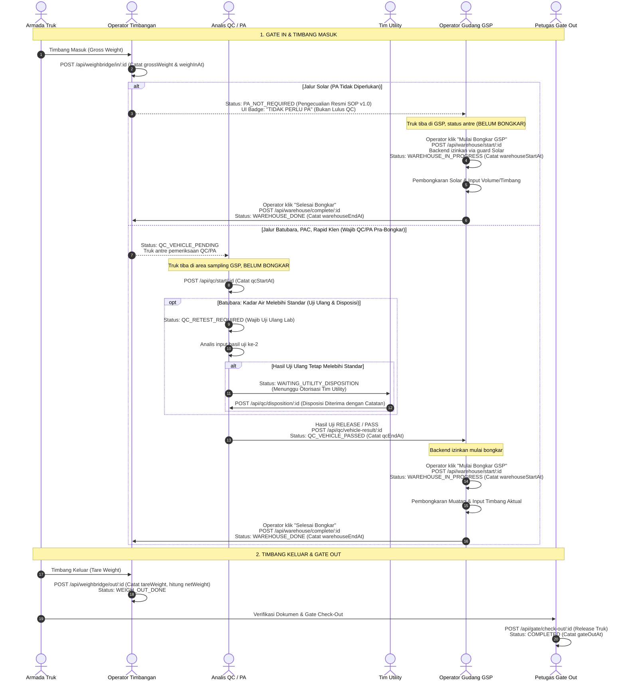

# DRAF SPESIFIKASI DESAIN: ALUR GSP 4 KELOMPOK BARANG & PEMERIKSAAN QC/PA (GMS)

- **Status Dokumen:** `DRAFT REVISI 3 — USULAN TEKNIS MENUNGGU VERIFIKASI SOP RESMI`
- **Tanggal Draf:** 29 September 2026
- **Baseline Git:** Branch `fix/gsp-process-audit-improvements` (Commit `8ec02bf` berbasis `master` `ae0b30c`)
- **Lingkungan Target:** Khusus Lokal / UAT (Tidak untuk merge atau deploy ke produksi tanpa persetujuan formal)
- **Batasan Ruang Lingkup:** Dibatasi ketat hanya pada **4 Kelompok Barang** (Batubara, Solar, PAC 280 AC / POLYCOR P9 / IPAC CIP A200, Rapid Klen / PRO-CIP B++). Kelompok ke-5 (bahan kimia baris kelima) ditunda dan tidak dimasukkan ke dalam implementasi tahap ini.

---

## 1. Pembedaan Tegas Tahap Waktu & Status Operasional

Berdasarkan penelusuran terhadap kode aktual `master` ([`weighbridge.service.ts`](file:///d:/Data%20Kacong/Antigravity%20Project/Aplikasi%20Gate%20Management%20System/backend/src/weighbridge/weighbridge.service.ts) dan [`warehouse.service.ts`](file:///d:/Data%20Kacong/Antigravity%20Project/Aplikasi%20Gate%20Management%20System/backend/src/warehouse/warehouse.service.ts)):
1. **Status Pasca Timbang Masuk:** Kode aktual saat ini menetapkan status `QC_VEHICLE_PENDING` setelah timbang masuk selesai untuk muatan yang memerlukan QC.
2. **Semantik `WAREHOUSE_IN_PROGRESS`:** Status ini dan timestamp `warehouseStartAt` secara semantik menandakan bahwa proses fisik pembongkaran barang di gudang **telah benar-benar dimulai** oleh operator gudang. Memakai status ini untuk merepresentasikan armada yang baru tiba/antre di GSP sebelum pemeriksaan QC/PA adalah kekeliruan yang akan membuat waktu mulai bongkar tercatat terlalu awal (*premature timestamping*).
3. **Integritas Audit Jalur Solar:** Solar **tidak boleh** dicatat sebagai `QC_VEHICLE_PASSED` karena tidak pernah menjalani pemeriksaan QC/PA. Menetapkan lulus fiktif melanggar prinsip audit trail. Oleh karena itu, dirancang status resmi **`PA_NOT_REQUIRED`** (atau transisi pengecualian resmi berbasis SOP) yang membedakan dengan tegas antara "Lulus QC" dan "Tidak Perlu QC".

Alur operasional di area GSP dipisahkan secara tegas menjadi 3 sub-tahap:



---

## 2. Matriks Transisi Status, Penjagaan API, dan Rekam Waktu

Berikut adalah perbandingan rinci untuk masing-masing kelompok barang:

| Kelompok Barang | Status Pasca Timbang Masuk | Penjagaan API Pra-Bongkar (*Pre-Unloading Guard*) | Aksi Mulai Bongkar Gudang | Status & Waktu Bongkar | Alur Pasca-Bongkar Gudang |
|---|---|---|---|---|---|
| **Solar** | **`PA_NOT_REQUIRED`** *(Bukan Lulus QC; tercatat resmi sebagai pengecualian SOP)* | `POST /api/warehouse/start/:id` memvalidasi status `PA_NOT_REQUIRED` **DAN** produk wajib terdaftar dalam whitelist bypass (`isPaExempt`). Menolak jika status masih `REGISTERED`. | Operator GSP menekan **"Mulai Proses GSP"** saat pembongkaran solar dimulai fisik. | Status beralih ke `WAREHOUSE_IN_PROGRESS`. `warehouseStartAt` dicatat akurat saat tombol ditekan. | Selesai bongkar ➔ `WAREHOUSE_DONE` (`warehouseEndAt`). Langsung menuju Timbang Keluar (`WEIGH_OUT_DONE`). Tidak ada incoming check! |
| **Batubara** | `QC_VEHICLE_PENDING` | `POST /api/warehouse/start/:id` **memblokir keras** (HTTP 400) bila status transaksi belum `QC_VEHICLE_PASSED`. Menahan armada selama uji awal, uji ulang (`QC_RETEST_REQUIRED`), atau menunggu disposisi Utility (`WAITING_UTILITY_DISPOSITION`). | Operator GSP hanya dapat menekan **"Mulai Proses GSP"** setelah terbit keputusan `RELEASE` / `QC_VEHICLE_PASSED`. | Status beralih ke `WAREHOUSE_IN_PROGRESS`. `warehouseStartAt` dicatat akurat saat tombol ditekan. | Selesai bongkar ➔ `WAREHOUSE_DONE` (`warehouseEndAt`). Langsung menuju Timbang Keluar (`WEIGH_OUT_DONE`). |
| **PAC 280 AC / POLYCOR P9 / IPAC CIP A200** | `QC_VEHICLE_PENDING` | `POST /api/warehouse/start/:id` **memblokir keras** (HTTP 400) bila status transaksi belum `QC_VEHICLE_PASSED`. | Operator GSP menekan **"Mulai Proses GSP"** setelah evaluasi Sensory & Chemical Analysis `RELEASE`. | Status beralih ke `WAREHOUSE_IN_PROGRESS`. `warehouseStartAt` dicatat akurat saat tombol ditekan. | Selesai bongkar ➔ `WAREHOUSE_DONE` (`warehouseEndAt`). Langsung menuju Timbang Keluar (`WEIGH_OUT_DONE`). |
| **Rapid Klen / PRO-CIP B++** | `QC_VEHICLE_PENDING` | `POST /api/warehouse/start/:id` **memblokir keras** (HTTP 400) bila status transaksi belum `QC_VEHICLE_PASSED`. | Operator GSP menekan **"Mulai Proses GSP"** setelah evaluasi Sensory & Chemical Analysis `RELEASE`. | Status beralih ke `WAREHOUSE_IN_PROGRESS`. `warehouseStartAt` dicatat akurat saat tombol ditekan. | Selesai bongkar ➔ `WAREHOUSE_DONE` (`warehouseEndAt`). Langsung menuju Timbang Keluar (`WEIGH_OUT_DONE`). |

---

## 3. Penjagaan Integritas & Anti-Tamper Jalur Solar

### A. Kebijakan Whitelist Produk Terdaftar (Server-Side Master Catalog)
Keputusan untuk melewati tahap QC/PA **tidak boleh** hanya mengandalkan string bebas `cargoSubType: 'Solar'` yang dikirim oleh client.
- Di backend, dibuat tabel/konstanta master data produk berizin bypass:
  ```typescript
  export interface PaExemptionPolicy {
    processType: 'GSP';
    cargoType: 'Fuel';
    cargoSubType: 'Solar';
    policyVersion: string; // e.g. 'SOP-GSP-2026.1'
    reason: string;
    isPaRequired: false;
  }
  ```
- Pada saat timbang masuk (`POST /api/weighbridge/in/:id`), backend memeriksa apakah kombinasi `processType`, `cargoType`, dan `cargoSubType` dari record database yang tersimpan cocok dengan kebijakan bypass aktif. Jika valid, status ditetapkan ke `PA_NOT_REQUIRED`.

### B. Perlindungan Koreksi Transaksi (*Anti-Tamper on Product Correction*)
Untuk mencegah celah keamanan operasional di mana armada didaftarkan sebagai `Solar` (untuk melewati QC) kemudian diubah menjadi `Batubara`:
1. **Aturan Modul Koreksi ([`operation-log-correction.service.ts`](file:///d:/Data%20Kacong/Antigravity%20Project/Aplikasi%20Gate%20Management%20System/backend/src/transactions/operation-log-correction.service.ts)):**
   - Jika admin melakukan koreksi data produk (`cargoType` atau `cargoSubType`) dari produk bebas-PA (`Solar`) menjadi produk wajib-PA (`Batubara`, `PAC`, `Rapid Klen`):
     - Jika transaksi berstatus `PA_NOT_REQUIRED`: status **wajib di-downgrade otomatis** menjadi `QC_VEHICLE_PENDING`.
     - Jika transaksi sudah berstatus `WAREHOUSE_IN_PROGRESS`, `WAREHOUSE_DONE`, atau lebih lanjut: koreksi perubahan produk **DITOLAK KERAS** (HTTP 400).
   - Perubahan hanya dapat diproses melalui prosedur *Reopen Workflow* resmi (`REOPEN_WORKFLOW`) yang membatalkan seluruh proses bongkar dan mengembalikan status fisik armada ke antrean QC Sampling (`QC_VEHICLE_PENDING`).

### C. Konsistensi Tampilan UI (Anti-False-Passed)
Pada seluruh modul antarmuka:
- **Dashboard & Antrean Gudang GSP:** Ditampilkan badge abu-abu kebiruan netral: **`TIDAK PERLU PA`** (Icon: `info_outline`), **bukan** hijau `QC PASSED`.
- **Detail Modal & Laporan Audit Trail:** Jejak audit mencatat:
  - *Peristiwa:* `PA_EXEMPTION_APPLIED`
  - *Keterangan:* `SOP Exemption Rule v1.0: Komoditas Solar BBM tidak memerlukan uji laboratorium pra-bongkar.`
  - Tidak memunculkan centang inspeksi QC palsu atau nama PIC QC fiktif.

---

## 4. Status Baru dalam Usulan, Migrasi Skema, dan RBAC

Usulan ini memerlukan penambahan status baru pada enum `TransactionStatus` di database PostgreSQL melalui migrasi Prisma:

### A. Penambahan Enum Prisma Schema (`schema.prisma`)
```prisma
enum TransactionStatus {
  REGISTERED
  WEIGH_IN_DONE
  QC_VEHICLE_PENDING
  QC_VEHICLE_IN_PROGRESS
  QC_VEHICLE_PASSED
  QC_VEHICLE_REJECTED
  
  // Status Baru yang Diusulkan:
  PA_NOT_REQUIRED              // Jalur resmi Solar (Bypass QC/PA terverifikasi)
  QC_RETEST_REQUIRED           // Batubara: Uji ulang kadar air
  WAITING_UTILITY_DISPOSITION  // Batubara: Menunggu otorisasi Tim Utility
  
  WAREHOUSE_IN_PROGRESS
  WAREHOUSE_DONE
  INCOMING_CHECK_PENDING
  INCOMING_CHECK_IN_PROGRESS
  INCOMING_CHECK_PASSED
  INCOMING_CHECK_REJECTED
  WEIGH_OUT_DONE
  COMPLETED
  CANCELLED
}
```

### B. Matriks Transisi yang Sah ([`workflow-state-machine.ts`](file:///d:/Data%20Kacong/Antigravity%20Project/Aplikasi%20Gate%20Management%20System/backend/src/common/state-machine/workflow-state-machine.ts))
```typescript
export const VALID_STATUS_TRANSITIONS: Record<TransactionStatus, TransactionStatus[]> = {
  REGISTERED: [
    TransactionStatus.WEIGH_IN_DONE,
    TransactionStatus.QC_VEHICLE_PENDING,
    TransactionStatus.PA_NOT_REQUIRED, // Transisi langsung bila didaftarkan
    TransactionStatus.CANCELLED,
  ],
  WEIGH_IN_DONE: [
    TransactionStatus.QC_VEHICLE_PENDING,
    TransactionStatus.PA_NOT_REQUIRED, // Khusus Solar pasca Timbang Masuk
    TransactionStatus.CANCELLED,
  ],
  PA_NOT_REQUIRED: [
    TransactionStatus.WAREHOUSE_IN_PROGRESS, // Mulai bongkar gudang
    TransactionStatus.CANCELLED,
  ],
  QC_VEHICLE_PENDING: [
    TransactionStatus.QC_VEHICLE_IN_PROGRESS,
    TransactionStatus.QC_VEHICLE_PASSED,
    TransactionStatus.QC_VEHICLE_REJECTED,
    TransactionStatus.QC_RETEST_REQUIRED, // Batubara: deviasi kadar air
    TransactionStatus.CANCELLED,
  ],
  QC_RETEST_REQUIRED: [
    TransactionStatus.QC_VEHICLE_IN_PROGRESS,
    TransactionStatus.QC_VEHICLE_PASSED, // Uji ulang lolos
    TransactionStatus.QC_VEHICLE_REJECTED,
    TransactionStatus.WAITING_UTILITY_DISPOSITION, // Uji ulang tetap gagal
    TransactionStatus.CANCELLED,
  ],
  WAITING_UTILITY_DISPOSITION: [
    TransactionStatus.QC_VEHICLE_PASSED, // Disposisi Utility disetujui (Dispensasi)
    TransactionStatus.QC_VEHICLE_REJECTED, // Disposisi Utility ditolak
    TransactionStatus.CANCELLED,
  ],
  QC_VEHICLE_PASSED: [
    TransactionStatus.WAREHOUSE_IN_PROGRESS,
    TransactionStatus.CANCELLED,
  ],
  WAREHOUSE_IN_PROGRESS: [
    TransactionStatus.INCOMING_CHECK_PENDING, // Khusus GBB (7-tahap)
    TransactionStatus.WAREHOUSE_DONE,        // Khusus GBJ dan GSP (langsung selesai gudang)
    TransactionStatus.CANCELLED,
  ],
  WAREHOUSE_DONE: [
    TransactionStatus.WEIGH_OUT_DONE,
    TransactionStatus.CANCELLED,
  ],
  WEIGH_OUT_DONE: [
    TransactionStatus.COMPLETED,
    TransactionStatus.CANCELLED,
  ],
  // ... status final ...
};
```

### C. Matriks Hak Akses & Kewenangan (RBAC)
| Transisi Status | Pihak / Role yang Berwenang | Mekanisme Guard |
|---|---|---|
| `REGISTERED` ➔ `PA_NOT_REQUIRED` | Sistem / Operator Timbangan | Diverifikasi otomatis terhadap master catalog produk Solar aktif |
| `QC_VEHICLE_PENDING` ➔ `QC_RETEST_REQUIRED` | Role `QC` | Analis QC memasukkan hasil uji awal kadar air yang melebihi standar |
| `QC_RETEST_REQUIRED` ➔ `WAITING_UTILITY_DISPOSITION` | Role `QC` | Analis QC memasukkan hasil uji ulang ke-2 yang tetap melebihi batas |
| `WAITING_UTILITY_DISPOSITION` ➔ `QC_VEHICLE_PASSED` | Role `UTILITY` (atau `ADMIN`) | **Dual Control:** Analis QC biasa dilarang menyetujui sendiri dispensasi ini; wajib otorisasi akun Utility |
| `PA_NOT_REQUIRED` ➔ `WAREHOUSE_IN_PROGRESS` | Role `WAREHOUSE` (GSP) | Operator gudang memulai pembongkaran fisik |
| `QC_VEHICLE_PASSED` ➔ `WAREHOUSE_IN_PROGRESS` | Role `WAREHOUSE` (GSP) | Operator gudang memulai pembongkaran fisik |

---

## 5. Sinkronisasi Endpoint Controller Aktual (Technical Contract)

Tabel berikut telah diselaraskan dengan rute controller aktual backend:

| Tahapan Operasional | Route Controller Aktual | Method | Role Guard | Deskripsi & Guard Validasi |
|---|---|:---:|---|---|
| **Gate Check-In** | `/api/gate/check-in` | `POST` | `SECURITY`, `ADMIN` | Registrasi nomor polisi, supir, vendor, dan pemilihan kelompok barang GSP. |
| **Timbang Masuk** | `/api/weighbridge/in/:transactionId` | `POST` | `SECURITY`, `ADMIN` | Catat `grossWeight`. Jika Solar ➔ status beralih ke `PA_NOT_REQUIRED`; selain itu ➔ `QC_VEHICLE_PENDING`. |
| **Mulai Pemeriksaan QC** | `/api/qc/start/:transactionId` | `POST` | `QC` | Memulai proses uji lab pra-bongkar (mencatat `qcStartAt`). |
| **Submit Hasil QC/PA** | `/api/qc/vehicle-result/:transactionId` | `POST` | `QC` | Submit hasil Sensory & Chemical/Proximate. Menghasilkan `QC_VEHICLE_PASSED`, `QC_VEHICLE_REJECTED`, atau `QC_RETEST_REQUIRED`. |
| **Submit Disposisi Utility** | `/api/qc/disposition/:transactionId` *(Usulan)* | `POST` | `UTILITY`, `ADMIN` | Input otorisasi disposisi kadar air batubara tinggi (mencatat `dispositionBy` dan `dispositionReason`). |
| **Mulai Bongkar GSP** | `/api/warehouse/start/:transactionId` | `POST` | `WAREHOUSE`, `ADMIN` | **Guard Backend:** Mengizinkan status `QC_VEHICLE_PASSED` ATAU (`PA_NOT_REQUIRED` khusus Solar). Mencatat **`warehouseStartAt`**. |
| **Selesai Bongkar GSP** | `/api/warehouse/complete/:transactionId` | `POST` | `WAREHOUSE`, `ADMIN` | Input bobot aktual. Untuk GSP langsung mengalihkan ke **`WAREHOUSE_DONE`** (mencatat `warehouseEndAt`). |
| **Timbang Keluar** | `/api/weighbridge/out/:transactionId` | `POST` | `SECURITY`, `ADMIN` | Catat `tareWeight`, hitung `netWeight`, alihkan ke `WEIGH_OUT_DONE`. |
| **Gate Check-Out** | `/api/gate/check-out/:id` | `POST` | `SECURITY`, `ADMIN` | Validasi akhir surat jalan & release armada (status `COMPLETED`, catat `gateOutAt`). |

---

## 6. Model Data QC/PA Analysis: Usulan Tabel `QcProductAnalysis`

Menolak kompromi penyimpanan JSON pada `QcVehicleCheck` yang berisiko merusak integritas audit, diajukan perancangan tabel terpisah `QcProductAnalysis` untuk menjaga jejak audit multi-round testing dan otorisasi disposisi:

```prisma
model QcProductAnalysis {
  id                    String        @id @default(uuid())
  transactionId         String
  testRound             Int           @default(1) // 1: Uji Awal, 2: Uji Ulang (Retest)
  productCategory       String        // BATUBARA | PAC | RAPID_KLEN
  productName           String        // Nama spesifik: PAC 280 AC, PRO-CIP B++, dsb.
  parameters            Json          // Data nilai hasil, COA, metode, dan status per parameter
  result                QcResult      // PASS | REJECT
  status                String        // RELEASED | RETEST_REQUIRED | WAITING_UTILITY_DISPOSITION | REJECTED
  
  // Jejak Audit Disposisi Tim Utility (Khusus Batubara):
  dispositionAction     String?       // DISPOSITION_ACCEPTED | DISPOSITION_REJECTED
  dispositionReason     String?       // Alasan teknis penyesuaian boiler / disposisi
  dispositionById       String?       // ID User PIC Utility yang mengotorisasi
  dispositionAt         DateTime?
  
  testedById            String?
  testedAt              DateTime      @default(now())
  createdAt             DateTime      @default(now())
  updatedAt             DateTime      @updatedAt

  transaction           Transaction   @relation(fields: [transactionId], references: [id], onDelete: Cascade)
  testedBy              User?         @relation("ProductAnalysisTestedBy", fields: [testedById], references: [id], onDelete: SetNull)
  dispositionBy         User?         @relation("ProductAnalysisDispositionBy", fields: [dispositionById], references: [id], onDelete: SetNull)

  @@index([transactionId])
  @@index([productCategory])
}
```

---

## 7. Status Keputusan Terbuka (Open Decisions Tracker)

| No | Poin Keputusan Bisnis / Teknis | Pilihan yang Tersedia | Status Rekomendasi |
|:--:|---|---|---|
| **1** | **Persetujuan Skema `QcProductAnalysis` & Enum Baru** | Migrasi tabel baru `QcProductAnalysis` dan enum `PA_NOT_REQUIRED`, `QC_RETEST_REQUIRED`, `WAITING_UTILITY_DISPOSITION` | **Rekomendasi Mutlak:** Wajib menggunakan skema tabel terpisah agar jejak audit multi-round retest dan otorisasi disposisi Utility dapat diaudit secara sah. Menunggu persetujuan DBA. |
| **2** | **Konfirmasi Standar ASTM Pabrik** | ASTM D3302 (Total Moisture) vs ASTM D3173 (Analysis Sample)<br/>Penulisan ASTM D3172 | Menunggu konfirmasi formal dokumen SOP Laboratorium Pabrik SJA. |
| **3** | **Spesifikasi per Varian Merek Produk** | Batas spesifik untuk `POLYCOR P9`, `IPAC CIP A200`, `PRO-CIP B++` | Menunggu lembar spesifikasi masing-masing produk dari tim Purchasing/QC. |
| **4** | **Hak Otorisasi Disposisi Utility** | Role `UTILITY` khusus vs Role `QC_SUPERVISOR` / `ADMIN` | Menunggu penetapan struktur wewenang pengguna dari manajemen pabrik. |
