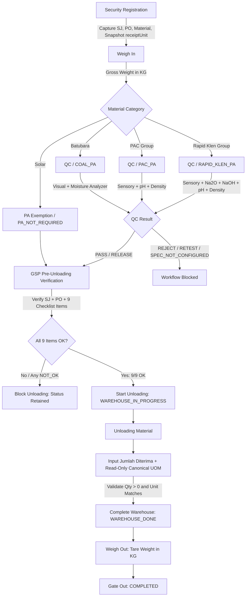

# Technical Specification: GSP QC/PA Form Alignment, Pre-Unloading Checklist & Material-Specific Receiving UOM

- **Document ID:** `SPEC-GSP-2026-10-07-01`
- **Topic:** Alignment of GSP QC/PA forms, atomic pre-unloading verification checklist, and material-specific receiving UOM architecture.
- **Authoritative Baseline SHA:** `8991907d681d12bafd44e9fdf604b4a0b70570aa`
- **Target Branch:** `fix/gsp-process-audit-improvements` (PR #27)
- **Status:** DRAFT SPECIFICATION (Awaiting User Review Before Implementation)

---

## 1. Executive Summary & Problem Statement

### 1.1 Background
The General Supplies (GSP) operational flow handles four primary material categories:
1. **Batubara (Coal)** (`COAL_PA`)
2. **Solar (High Speed Diesel)** (`PA_NOT_REQUIRED`)
3. **PAC 280 AC / PAC Group (Chemical UTL)** (`PAC_PA`)
4. **Rapid Klen / CIP Alkaline Group (Chemical PROD)** (`RAPID_KLEN_PA`)

Recent operational review established authentic laboratory analysis sheets and receiving protocols. The prior system implementation contained several structural gaps:
1. **Generic / Out-of-Spec QC Parameters:**
   - Coal used generic sensory items ("Bau Normal", "Keseragaman Ukuran") not on the operational sheet, and assumed an unverified `4200 kcal/kg → max TM 33%` contract rule.
   - PAC required Al₂O₃ as a mandatory laboratory entry, which is absent from the operational sheet.
   - Rapid Klen allowed non-strict boundary interpretations.
   - Evaluation was gated behind `PENDING_SIGNOFF` blockers requiring artificial approvals.
2. **Pre-Unloading Verification Gap:**
   - Warehouse Start only checked Surat Jalan and PO presence, omitting the mandatory 9-point vehicle, goods, and document inspection.
3. **Physical Weighbridge Weight vs Commercial Received Quantity Conflation:**
   - GSP receiving conflated vehicle weight (KG) with received volume/quantity, displaying generic "Input Actual Weight GSP (KG)" even for bulk liquids (Solar, PAC, Rapid Klen).
   - Database schema lacked `LITER` in `WarehouseUnit` and stored receiving quantities as integer or physical float weight.

### 1.2 Core Objectives
- Align QC/PA forms strictly with the three authoritative operational laboratory sheets.
- Implement an atomic 9-point Pre-Unloading Checklist persisted directly into `WarehouseProcess.checklistItems` utilizing `startById` and `startAt`.
- Decouple physical weighbridge measurements (gross, tare, net in **KG**) from commercial received quantity (**Jumlah Diterima** in material-specific canonical UOM: Batubara = **KG**, Solar / PAC / Rapid Klen = **LITER**).
- Support decimal receipt quantities (`Decimal(12, 3)`) without truncation.
- Maintain fail-closed boundaries: reject unmapped Coal calorie ranges (`SPEC_NOT_CONFIGURED`), reject invalid UOMs, and block unloading if any pre-unloading checklist item is not `OK`.

---

## 2. End-to-End GSP Workflow Architecture



### Stage Summary:
1. **Security Registration:** Capture vendor, vehicle, driver, SJ, PO, and select ProductCatalog. Snapshot canonical `ProductCatalog.receiptUnit` to `Transaction.receiptUnit`.
2. **Weigh In:** Weighbridge scale captures `grossWeight` in **KG**.
3. **QC Product Analysis (PA):**
   - Batubara, PAC, Rapid Klen undergo authoritative laboratory analysis.
   - Solar fast-tracks directly to `PA_NOT_REQUIRED`.
4. **Pre-Unloading Verification:**
   - Operator conducts 9-item inspection.
   - Submission of `StartWarehouseDto` atomically validates checklist and creates `WarehouseProcess` (`WAREHOUSE_IN_PROGRESS`).
5. **Material Receiving:**
   - Warehouse operator records actual received quantity (`receivedQuantity` with read-only canonical `receivedUnit`).
   - Weighbridge net weight remains distinct in KG.
6. **Weigh Out & Gate Out:** Captures tare weight in KG and finalizes gate exit.

---

## 3. Authoritative QC / PA Form Specifications & Evaluation Engine

All evaluation logic is **server-authoritative**. The frontend only submits factual observations and measurements.

Active configured rules represent approved operational requirements and evaluate directly to `PASS` (status `RELEASE`) or `REJECT` (status `REJECT` / `RETEST_REQUIRED`) without requiring artificial `PENDING_SIGNOFF` approvals.

### 3.1 Batubara (`COAL_PA`)

#### A. Visual Analysis (Method: `Visual Analysis`)
| Parameter | Permitted Specification Values | Evaluation Criteria |
|---|---|---|
| `kondisi` | `Kering (Tidak Basah)` | Mandatory: must be dry before dumping |
| `warna` | `Hitam`, `Hitam Kecoklatan`, `Coklat` | Must match one of the permitted colors |
| `levelRank` | `High Rank Coal`, `Medium Rank Coal`, `Low Rank Coal` | Must match one of the permitted ranks |
| `kilap` | `Hitam Mengkilap`, `Hitam Kecoklatan`, `Mudah Lapuk` | Must match one of the permitted luster types |
| `bahanPengotor` | `Tidak ada kontaminasi batuan maupun tanah` | Mandatory: free from rock or soil contamination |

*Note:* Generic parameters ("Bau Normal", "Keseragaman Ukuran") are removed.

#### B. Moisture Analysis (Method: `Digital Moisture Analyzer`)
| Calorie Tier (GAR / kcal/kg) | Maximum Total Moisture (TM) | Evaluation Action |
|---|---|---|
| `> 6000` | `<= 25.0%` | Within limit → PASS; Exceeds → Retest (R1) / Reject (R2) |
| `5600 – 6000` | `<= 33.0%` | Within limit → PASS; Exceeds → Retest (R1) / Reject (R2) |
| `< 5600` (e.g. 4200, 3800, 5000) | *Unmapped / No operational source* | **Fail Closed:** `decision: 'SPEC_NOT_CONFIGURED'` (`isWithinSpec: false`). Rejection is withheld; decision is blocked pending specification configuration. |

*Safety Invariant:* The UI does not offer or select calorie tiers that lack configured operational specifications.

---

### 3.2 PAC (`PAC_PA`)

#### A. Sensory Analysis (Method: `Visual Evaluation`)
| Parameter | Permitted Specification | Evaluation Criteria |
|---|---|---|
| `visual` | `Kuning, Coklat Jernih` | Must be clear yellow/amber liquid |
| `foreignMatters` | `Tidak ada kontaminasi` | Must be free from particulate or sediment |
| `packagingLabel` | `Kemasan & label tidak rusak` | Packaging and labeling intact |

#### B. Chemical Analysis
| Parameter | Specification Range | Method | Boundary Semantics |
|---|---|---|---|
| `ph` (1% solution) | `3.5` – `5.0` | pH Meter | Inclusive (`3.50 <= ph <= 5.00`) |
| `density` (Specific Gravity) | `1.170` – `1.260` gr/cm³ | Hydrometer | Inclusive (`1.170 <= density <= 1.260`) |

*Note:* Al₂O₃ is removed as a mandatory parameter from the operational PAC form.

---

### 3.3 Rapid Klen (`RAPID_KLEN_PA`)

#### A. Sensory Analysis (Method: `Visual Evaluation`)
| Parameter | Permitted Specification | Evaluation Criteria |
|---|---|---|
| `visual` | `Jernih` | Must be completely clear liquid |
| `foreignMatters` | `Tidak ada kontaminasi` | Free from foreign matter |
| `packagingLabel` | `Kemasan & label tidak rusak` | Packaging and factory seal intact |

#### B. Chemical Analysis (Strict Greater-Than `>` Limits)
| Parameter | Specification | Method | Strict Boundary Rule |
|---|---|---|---|
| `% Alkalinity (Na₂O)` | `> 35.00%` | Titrasi | Value `<= 35.00` → **FAIL** (`35.00` exactly = FAIL) |
| `% Alkalinity (NaOH)` | `> 45.16%` | Titrasi | Value `<= 45.16` → **FAIL** (`45.16` exactly = FAIL) |
| `pH` (1% solution) | `> 12.000` | pH Meter | Value `<= 12.000` → **FAIL** (`12.000` exactly = FAIL) |
| `Density` | `> 1.400` gr/cm³ | Hydrometer | Value `<= 1.400` → **FAIL** (`1.400` exactly = FAIL) |

---

## 4. GSP Pre-Unloading Checklist Architecture

### 4.1 Nine Mandatory Inspection Items
Before unloading can commence, the warehouse operator must inspect and confirm the following 9 items:

| # | Code | Label / Deskripsi Pemeriksaan |
|---|---|---|
| 1 | `CLEAN_VEHICLE` | Kendaraan bersih |
| 2 | `DOOR_SEAL_GOOD` | Seal pintu kendaraan baik |
| 3 | `NO_EXPIRED_GAS_CYLINDER` | Tidak ditemukan tabung gas yang sudah Exp date masa uji berlakunya |
| 4 | `ITEMS_NEATLY_ARRANGED` | Barang tertata rapi |
| 5 | `NO_PEST_OR_ANIMAL_TRACE` | Tidak ditemukan hama / binatang dan/atau jejak / bekas binatang |
| 6 | `GOOD_CLEAN_SEALED` | Barang baik dan bersih serta tersegel |
| 7 | `COA_MATCHES_BATCH` | CoA tersedia dan sesuai batchnya |
| 8 | `QTY_TYPE_MATCHES_SJ` | Jumlah dan jenis barang sesuai SJ |
| 9 | `VEHICLE_NO_LEAK_GOOD` | Kendaraan tidak bocor / kondisi baik |

### 4.2 Checklist Persistence & Audit Model
Checklist items are persisted directly into `WarehouseProcess.checklistItems` (Prisma `Json` field).
No auxiliary tables are created. Operator identity and execution timestamp are captured natively via:
- `WarehouseProcess.startById` = authenticated warehouse operator ID
- `WarehouseProcess.startAt` = timestamp when startWarehouse was executed

#### Data Structure for `WarehouseProcess.checklistItems`:
```json
{
  "version": "GSP-PREUNLOAD-2026.1",
  "verifiedAt": "2026-10-07T10:30:00.000Z",
  "verifiedBy": "user-uuid",
  "overallResult": "OK",
  "items": [
    { "code": "CLEAN_VEHICLE", "label": "Kendaraan bersih", "result": "OK", "notes": "" },
    { "code": "DOOR_SEAL_GOOD", "label": "Seal pintu kendaraan baik", "result": "OK", "notes": "" },
    { "code": "NO_EXPIRED_GAS_CYLINDER", "label": "Tidak ditemukan tabung gas yang sudah Exp date masa uji berlakunya", "result": "OK", "notes": "" },
    { "code": "ITEMS_NEATLY_ARRANGED", "label": "Barang tertata rapi", "result": "OK", "notes": "" },
    { "code": "NO_PEST_OR_ANIMAL_TRACE", "label": "Tidak ditemukan hama / binatang dan/atau jejak / bekas binatang", "result": "OK", "notes": "" },
    { "code": "GOOD_CLEAN_SEALED", "label": "Barang baik dan bersih serta tersegel", "result": "OK", "notes": "" },
    { "code": "COA_MATCHES_BATCH", "label": "CoA tersedia dan sesuai batchnya", "result": "OK", "notes": "" },
    { "code": "QTY_TYPE_MATCHES_SJ", "label": "Jumlah dan jenis barang sesuai SJ", "result": "OK", "notes": "" },
    { "code": "VEHICLE_NO_LEAK_GOOD", "label": "Kendaraan tidak bocor / kondisi baik", "result": "OK", "notes": "" }
  ]
}
```

### 4.3 Atomic Gate Validation Rule (`startWarehouse`)
`startWarehouse` accepts:
```typescript
export class StartWarehouseDto {
  @IsOptional() @IsString() suratJalanNumber?: string;
  @IsOptional() @IsString() poNumber?: string;
  @IsOptional() @IsString() remarks?: string;
  @IsOptional() @ValidateNested() @Type(() => PreUnloadChecklistDto)
  preUnloadChecklist?: PreUnloadChecklistDto;
}
```

For transactions where `processType === 'GSP'`:
1. `suratJalanNumber` is **MANDATORY** (non-empty string).
2. `poNumber` is **MANDATORY** (non-empty string).
3. `preUnloadChecklist` is **MANDATORY**.
4. All 9 defined items must be present and have `result === 'OK'`.
5. If any item is `NOT_OK` or missing:
   - The transaction status remains unchanged (held at `QC_VEHICLE_PASSED` or `PA_NOT_REQUIRED`).
   - Request is rejected with `BadRequestException`:
     `"Pemeriksaan pra-bongkar belum memenuhi persyaratan."`

---

## 5. Physical Weight vs Commercial Quantity & UOM Architecture

### 5.1 Clear Separation of Responsibilities
```
┌─────────────────────────────────────────────────────────────┐
│ WEIGHBRIDGE MODULE                                          │
│ - grossWeight (KG)                                          │
│ - tareWeight (KG)                                           │
│ - netWeight (KG)                                            │
│ Physical vehicle mass — strictly KG across all processes.   │
└─────────────────────────────────────────────────────────────┘
                             vs
┌─────────────────────────────────────────────────────────────┐
│ WAREHOUSE GSP RECEIVING MODULE                              │
│ - receivedQuantity (Decimal, e.g. 16500.000)                │
│ - receivedUnit (WarehouseUnit, e.g. LITER)                  │
│ Commercial material inventory receipt — material-specific.  │
└─────────────────────────────────────────────────────────────┘
```

### 5.2 Canonical UOM Mapping per Material
| Material Category | Canonical Product | Canonical Receipt UOM |
|---|---|---|
| **Coal / Batubara** | Batubara (`COAL-001`) | **KG** |
| **Fuel / Solar** | Solar (`SOLAR-001`) | **LITER** |
| **Chemical UTL** | PAC 280 AC (`PAC-001`), POLYCOR P9 (`PAC-002`), IPAC CIP A200 (`PAC-003`) | **LITER** |
| **Chemical PROD** | Rapid Klen (`RPD-001`), PRO-CIP B++ (`RPD-002`) | **LITER** |

### 5.3 Snapshot Mechanism
1. Master data: `ProductCatalog.receiptUnit` defines the standard unit.
2. At Security Registration: `Transaction.receiptUnit` is snapshotted from `ProductCatalog.receiptUnit`.
3. In Warehouse UI: `receiptUnit` is rendered as **READ-ONLY**. The operator cannot change or override it.
4. At Warehouse Completion (`completeWarehouse`):
   - Operator submits `receivedQuantity` (Decimal) and `receivedUnit`.
   - Backend asserts `receivedUnit === transaction.receiptUnit`. If mismatched, the request is rejected (`BadRequestException`).
   - Persisted to `WarehouseProcess.receivedQuantity`, `WarehouseProcess.receivedUnit`, and summarized on `Transaction.receivedQuantity`.

---

## 6. Schema & Migration Design

### 6.1 Prisma Schema Changes (Additive Migration)
```prisma
// 1. Extend WarehouseUnit enum
enum WarehouseUnit {
  KG
  PCS
  BAG
  ROLL
  PALLET
  LITER    // ADDED
}

// 2. Extend ProductCatalog model
model ProductCatalog {
  // ... existing fields ...
  receiptUnit        WarehouseUnit?   // ADDED: Canonical receiving UOM
  // ...
}

// 3. Extend Transaction model
model Transaction {
  // ... existing fields ...
  receiptUnit           WarehouseUnit?   // ADDED: Canonical receipt UOM snapshot
  receivedQuantity      Decimal?         @db.Decimal(12, 3) // ADDED: Summary of received quantity
  // ... existing actualWeight, actualQuantity, warehouseUnit retained for GBB/GBJ compatibility ...
}

// 4. Extend WarehouseProcess model
model WarehouseProcess {
  // ... existing fields ...
  receivedQuantity      Decimal?         @db.Decimal(12, 3) // ADDED: Decimal-capable received quantity
  receivedUnit          WarehouseUnit?   // ADDED: Recorded unit
  // checklistItems Json? already exists natively
}
```

### 6.2 Data Migration & Backfill Strategy
- SQL Migration adds `LITER` to PostgreSQL enum `WarehouseUnit`.
- Adds columns `receiptUnit`, `receivedQuantity`, `receivedUnit` as nullable (zero downtime, non-breaking).
- Backfills `ProductCatalog.receiptUnit` for known canonical GSP catalog records:
  - `COAL-001` → `KG`
  - `SOLAR-001` → `LITER`
  - `PAC-001`, `PAC-002`, `PAC-003` → `LITER`
  - `RPD-001`, `RPD-002` → `LITER`
- Backfills active in-flight GSP transactions to snapshot `receiptUnit` from their joined `ProductCatalog`.

---

## 7. Frontend User Experience & UI Specifications

### 7.1 Pre-Unloading Screen (Before Unloading)
- **Header:** Transaction Number, Plate Number, Material Name, Vendor Name, Surat Jalan, PO Number.
- **Section 1: Verification Data:**
  - Input Surat Jalan Number (pre-filled if present).
  - Input PO Number (pre-filled if present).
- **Section 2: Checklist Kendaraan, Barang & Dokumen:**
  - 9 interactive inspection items with clear radio/toggles (`[ OK ]` / `[ NOT OK ]`) and optional notes.
- **Action:**
  - Button `[ MULAI BONGKAR ]` is **disabled** until:
    - Surat Jalan is filled
    - PO is filled
    - All 9 checklist items are checked as `OK`.

### 7.2 Receiving Input Screen (During Unloading)
- **Title:** Selesai Penerimaan Barang (GSP)
- **Fields:**
  - **Material:** Displayed read-only (e.g. `PAC 280 AC`).
  - **Jumlah Diterima:** Number input supporting decimals (e.g., `8000.000` or `24850.750`). Label dynamically adjusts:
    - Coal: `Jumlah Diterima (KG)`
    - Solar/PAC/Rapid: `Jumlah Diterima (LITER)`
  - **Satuan (UOM):** Displayed as **Read-Only Badge** (`KG` or `LITER`), not an editable dropdown.
- **Action:**
  - Button `[ SELESAIKAN PENERIMAAN ]` triggers `completeWarehouse`.

---

## 8. Testing & Verification Matrix

### 8.1 QC/PA Form Tests
1. **Coal:**
   - Exact visual parameters verified.
   - Calorie >6000: TM `<= 25%` → PASS; TM `> 25%` → Retest/Reject.
   - Calorie 5600–6000: TM `<= 33%` → PASS; TM `> 33%` → Retest/Reject.
   - Calorie <5600: Unmapped tier triggers `SPEC_NOT_CONFIGURED` without automated reject.
2. **PAC:**
   - pH: 3.5 PASS, 5.0 PASS, <3.5 FAIL, >5.0 FAIL.
   - Density: 1.170 PASS, 1.260 PASS, <1.170 FAIL, >1.260 FAIL.
   - Absence of Al₂O₃ does not block PASS.
3. **Rapid Klen:**
   - Na₂O: 35.00 FAIL, 35.01 PASS.
   - NaOH: 45.16 FAIL, 45.17 PASS.
   - pH: 12.000 FAIL, 12.001 PASS.
   - Density: 1.400 FAIL, 1.401 PASS.

### 8.2 Pre-Unloading Checklist Tests
1. Coal PASS + all 9 items OK → Warehouse Start ALLOWED.
2. Coal PASS + 1 item NOT_OK → Warehouse Start REJECTED.
3. Solar PA_NOT_REQUIRED + all 9 items OK → Warehouse Start ALLOWED.
4. Solar + incomplete checklist → Warehouse Start REJECTED.
5. Missing Surat Jalan or PO → Warehouse Start REJECTED.

### 8.3 Receiving UOM Tests
1. Coal + `receivedQuantity: 24850.75` + `unit: KG` → ACCEPTED.
2. Coal + `unit: LITER` → REJECTED (HTTP 400).
3. Solar + `receivedQuantity: 16500.00` + `unit: LITER` → ACCEPTED.
4. Solar + `unit: KG` → REJECTED (HTTP 400).
5. Decimal quantities stored accurately without integer truncation.

### 8.4 GBB & GBJ Non-Regression Tests
1. Full test pass on GBB 7-stage lifecycle.
2. Full test pass on GBJ dispatch lifecycle.
3. Weighbridge gross/tare/net behavior completely unchanged.

---

## 9. Scope & Safety Guardrails

- **Zero Utility Reintroduction:** No Utility roles, endpoints, or deviation overrides.
- **Fail-Closed Governance:** Unmapped specifications block decisions safely.
- **Branch & Deployment Isolation:**
  - All changes made on `fix/gsp-process-audit-improvements`.
  - PR #27 remains **OPEN** (`merged = false`).
  - **No deployment** to staging or production without independent authorization.
