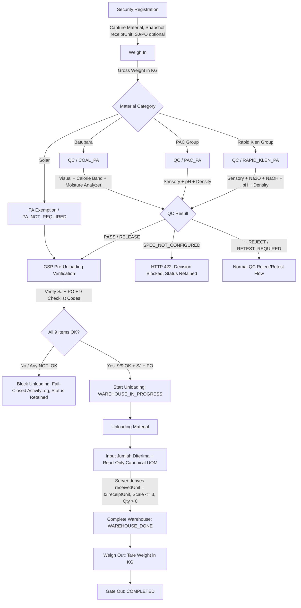

# Technical Specification: GSP QC/PA Form Alignment, Pre-Unloading Checklist & Material-Specific Receiving UOM

- **Document ID:** `SPEC-GSP-2026-10-07-01`
- **Revision:** `Rev 2.1 (Final Architecture & Operational Locking)`
- **Topic:** Alignment of GSP QC/PA forms, server-authoritative pre-unloading verification checklist, material-specific receiving UOM architecture, and active amendment synchronization.
- **Authoritative Baseline SHA:** `8991907d681d12bafd44e9fdf604b4a0b70570aa`
- **Target Branch:** `fix/gsp-process-audit-improvements` (PR #27)
- **Status:** FINAL SPECIFICATION (Awaiting Independent Audit Approval for Implementation Plan)

---

## 1. Executive Summary & Problem Statement

### 1.1 Background
The General Supplies (GSP) operational flow handles four primary material categories:
1. **Batubara (Coal)** (`COAL_PA`)
2. **Solar (High Speed Diesel)** (`PA_NOT_REQUIRED`)
3. **PAC 280 AC / PAC Group (Chemical UTL)** (`PAC_PA`)
4. **Rapid Klen / CIP Alkaline Group (Chemical PROD)** (`RAPID_KLEN_PA`)

Operational review established authentic laboratory analysis sheets and receiving protocols. The prior system implementation contained several structural gaps:
1. **Generic / Out-of-Spec QC Parameters & Ambiguous Governance:**
   - Coal used generic sensory items ("Bau Normal", "Keseragaman Ukuran") not on the operational sheet, attempted to infer target calories from `ProductCatalog.code` / `cargoSubType`, and assumed an unverified `4200 kcal/kg → max TM 33%` fallback rule.
   - PAC required Al₂O₃ as a mandatory laboratory entry, which is absent from the operational sheet.
   - Rapid Klen allowed non-strict boundary interpretations.
   - Confirmed operational rules were blocked by artificial `PENDING_SIGNOFF` gates requiring fictional approvals.
2. **Pre-Unloading Verification Gap:**
   - Warehouse Start only checked Surat Jalan and PO presence, omitting the mandatory 9-point vehicle, goods, and document inspection.
3. **Physical Weighbridge Weight vs Commercial Received Quantity Conflation:**
   - GSP receiving conflated vehicle weight (KG) with received volume/quantity, displaying generic "Input Actual Weight GSP (KG)" even for bulk liquids (Solar, PAC, Rapid Klen).
   - Database schema lacked `LITER` in `WarehouseUnit` and stored receiving quantities as integer or physical float weight.
4. **Stale UOM on Active Transaction Amendment:**
   - Existing active transaction amendment allowed updating GSP material identity before unloading, but lacked synchronization for the receiving UOM snapshot.

### 1.2 Core Objectives
- Align QC/PA forms strictly with the three authoritative operational laboratory sheets under the neutral runtime classification **`ACTIVE_CONFIGURED`** (without fabricated signoff metadata and without artificial `PENDING_SIGNOFF` blockers).
- Introduce explicit canonical calorie bands for Coal (`COAL_5600_6000`, `COAL_GT_6000`) and define exact fail-closed behavior (`SPEC_NOT_CONFIGURED` / HTTP 422) for unmapped ranges (<5600 kcal/kg), with DTO validation allowing evaluator-level HTTP 422 enforcement.
- Implement a server-authoritative 9-point Pre-Unloading Checklist persisted into `WarehouseProcess.checklistItems` using `startById` and `startAt`, with failed attempts logged to `ActivityLog`.
- Clarify Surat Jalan and PO responsibility: optional at Security Registration, but **strictly mandatory** before GSP Warehouse Start.
- Decouple physical weighbridge measurements (gross, tare, net in **KG**) from commercial received quantity (**Jumlah Diterima** in material-specific canonical UOM: Batubara = **KG**, Solar / PAC / Rapid Klen = **LITER**).
- Make receiving UOM 100% server-authoritative: read-only on frontend, derived from `Transaction.receiptUnit` (snapshotted from `ProductCatalog.receiptUnit`), stored in decimal-capable fields (`Decimal(12, 3)`), strictly rejecting scale >3 decimals (HTTP 400 `INVALID_RECEIVED_QUANTITY_SCALE`), with no ambiguous dual-write to legacy fields (`actualWeight`, `actualQuantity`).
- Synchronize `Transaction.receiptUnit` atomically during Active Transaction Amendment before Warehouse Start.

---

## 2. End-to-End GSP Workflow Architecture



### 2.1 Stage Responsibility & Gate Clarification
1. **Security Registration (Gate In):**
   - Captures vehicle, driver, plate number, vendor, and selects active `ProductCatalog`.
   - **Receipt UOM Snapshot:** Server snapshots `ProductCatalog.receiptUnit` to `Transaction.receiptUnit`.
   - **Surat Jalan & PO:** May be captured if already available from driver, but missing SJ/PO **does NOT block** Security Registration or Weigh-In.
2. **Weigh In:**
   - Physical weighbridge scale records `grossWeight` in **KG**.
3. **QC Product Analysis (PA):**
   - Batubara, PAC, Rapid Klen undergo authoritative laboratory analysis.
   - Solar fast-tracks directly to `PA_NOT_REQUIRED`.
4. **Active Transaction Amendment (Permitted Before Unloading):**
   - Admin may amend product catalog if erroneous material was registered at gate.
   - Atomically updates `productCatalogId`, cargo identity, analysis profile, and replaces `Transaction.receiptUnit = newCatalog.receiptUnit`.
   - Prohibited once transaction reaches `WAREHOUSE_IN_PROGRESS` or later.
5. **GSP Pre-Unloading Verification (Hard Gate):**
   - SJ and PO **MUST** both be present (prefilled if entered at Security; operator must complete them if missing).
   - Operator submits 9 checklist codes.
   - Starting unloading requires: valid weigh-in + PA RELEASE (or Solar exempt) + SJ + PO + all 9 checklist codes evaluated as `OK`.
   - Atomically updates status to `WAREHOUSE_IN_PROGRESS` and creates `WarehouseProcess`.
6. **GSP Material Receiving:**
   - Operator records actual received quantity (`receivedQuantity` supporting up to 3 decimal places).
   - UOM is displayed **read-only**; backend derives `receivedUnit = Transaction.receiptUnit`.
   - Physical weighbridge gross/tare/net weight remains completely separate in **KG**.
7. **Weigh Out & Gate Out:** Captures tare weight in KG and finalizes gate exit.

---

## 3. Authoritative QC / PA Form Specifications & Evaluation Engine

All evaluation logic is **server-authoritative**. The frontend only submits factual observations and measurements.

### 3.1 Governance Classification: `ACTIVE_CONFIGURED`
- The evaluators for Coal, PAC, and Rapid Klen operate under the neutral runtime rule status:
  `ruleStatus: 'ACTIVE_CONFIGURED'`
- The system **must NOT fabricate** `approvedBy`, `approvedAt`, fake SOP document numbers, or fictional QA signoff identities.
- The system **removes the legacy `PENDING_SIGNOFF` release blocker** for these confirmed operational rules. Compliant analysis produces automated `RELEASE` without requiring legacy `approvalStatus === 'APPROVED'`.
- Test fixtures remain independently isolated in test harness configurations.

---

### 3.2 Batubara (`COAL_PA`)

#### A. Prohibition on Calorie Inference
The system **must NOT** derive target calorie from:
- `ProductCatalog.code` (e.g. `COAL-001`)
- `cargoSubType` (e.g. `Batubara`)
- Free-text material descriptions
- Default/fallback assumptions (e.g. `4200 → 33%` fallback is strictly removed).

#### B. API Contract & Canonical Calorie Bands
The Coal PA DTO accepts `calorieBand` as a string code:
```typescript
export class SubmitCoalAnalysisDto {
  @IsString()
  @IsNotEmpty()
  calorieBand: string;

  @IsNumber()
  totalMoisture: number;

  // visual analysis fields...
}
```
*Note:* The DTO does not use `@IsEnum` on a restricted enum that would reject unknown bands with a generic HTTP 400. Instead, string input is validated at the evaluator level to return the business-specific HTTP 422 error.

Canonical configured bands recognized by backend:
| Calorie Band Code | Description / Specification | Maximum Total Moisture (TM) |
|---|---|---|
| `COAL_GT_6000` | Kalori > 6000 kcal/kg | `<= 25.0%` |
| `COAL_5600_6000` | Kalori 5600–6000 kcal/kg | `<= 33.0%` |

The normal frontend UI displays **only** these two configured choices.

#### C. Exact Definition of `SPEC_NOT_CONFIGURED`
`SPEC_NOT_CONFIGURED` is **NOT**:
- `PASS`
- `REJECT`
- `RETEST_REQUIRED`
- `RELEASE`

If an unconfigured calorie band (e.g. `< 5600 kcal/kg`, arbitrary string, or unmapped value) is submitted:
1. Backend throws a deterministic HTTP 422 Unprocessable Entity:
   ```json
   {
     "statusCode": 422,
     "error": "SPEC_NOT_CONFIGURED",
     "message": "Spesifikasi acuan kalori batubara belum dikonfigurasi. Evaluasi diblokir tanpa keputusan rilis/tolak otomatis."
   }
   ```
2. **State Protection:** Transaction remains in its current state (`QC_VEHICLE_IN_PROGRESS`). It does **NOT** transition to `QC_VEHICLE_REJECTED`, `QC_RETEST_REQUIRED`, or `QC_VEHICLE_PASSED`.
3. **Audit Trail:** An `ActivityLog` entry is recorded:
   - Module: `QC`
   - Action: `COAL_SPEC_NOT_CONFIGURED`
   - Description: `"Evaluation blocked: Calorie band has no configured operational specification."`
4. No artificial `QcResult.REJECT` record is created.

#### D. Visual Analysis (Method: `Visual Analysis`)
Exact operational source wording must be preserved:
| Parameter | Permitted Specification Values | Evaluation Criteria |
|---|---|---|
| `kondisi` | `Kering (Tidak Basah)` | Mandatory: must be dry before dumping |
| `warna` | `Hitam`, `Hitam Kecoklatan`, `Coklat` | Must match one of the permitted colors |
| `levelRank` | `High Rank Coal`, `Medium Rank Coal`, `Low Rank Coal` | Must match one of the permitted ranks |
| `kilap` | `Hitam Mengkilap`, `Hitam Kecoklatan`, `Mudah Lapuk` | Must match one of the permitted luster types |
| `bahanPengotor` | `Tidak ada kontaminasi batuan maupun tanah` | Mandatory: free from rock or soil contamination |

*Removed:* Generic parameters ("Bau Normal", "Keseragaman Ukuran") are completely removed.

#### E. Moisture Analysis (Method: `Digital Moisture Analyzer`)
- Tested against the submitted `calorieBand`.
- Round 1 compliant → `RELEASE`.
- Round 1 non-compliant → `RETEST_REQUIRED`.
- Round 2 compliant → `RELEASE`.
- Round 2 non-compliant → `REJECT`.

---

### 3.3 PAC (`PAC_PA`)

#### A. Sensory Analysis (Method: `Visual Evaluation`)
Exact operational source wording must be preserved without paraphrasing:
| Parameter | Permitted Specification Values | Evaluation Criteria |
|---|---|---|
| `visual` | `Kuning`, `Coklat Jernih` | Must match one of the permitted visual states |
| `foreignMatters` | `Tidak ada kontaminasi` | Mandatory: free from foreign matter/sediment |
| `packagingLabel` | `Kemasan & label tidak rusak` | Mandatory: packaging and label intact |

#### B. Chemical Analysis
| Parameter | Specification Range | Method | Boundary Semantics |
|---|---|---|---|
| `ph` (1% solution) | `3.5` – `5.0` | pH Meter | Inclusive (`3.50 <= ph <= 5.00`) |
| `density` (Specific Gravity) | `1.170` – `1.260` gr/cm³ | Hydrometer | Inclusive (`1.170 <= density <= 1.260`) |

*Removed:* Al₂O₃ is completely removed from mandatory operational form validation.

---

### 3.4 Rapid Klen (`RAPID_KLEN_PA`)

#### A. Sensory Analysis (Method: `Visual Evaluation`)
Exact operational source wording must be preserved:
| Parameter | Permitted Specification Values | Evaluation Criteria |
|---|---|---|
| `visual` | `Jernih` | Mandatory: clear liquid |
| `foreignMatters` | `Tidak ada kontaminasi` | Mandatory: free from foreign matter |
| `packagingLabel` | `Kemasan & label tidak rusak` | Mandatory: packaging and factory seal intact |

#### B. Chemical Analysis (Strict Greater-Than `>` Limits)
All limits are strictly greater than. Values exactly on the boundary are **FAIL**:
| Parameter | Specification | Method | Strict Boundary Rule |
|---|---|---|---|
| `% Alkalinity (Na₂O)` | `> 35.00%` | Titrasi | Value `<= 35.00` → **FAIL** (`35.00` exactly = FAIL) |
| `% Alkalinity (NaOH)` | `> 45.16%` | Titrasi | Value `<= 45.16` → **FAIL** (`45.16` exactly = FAIL) |
| `pH` (1% solution) | `> 12.000` | pH Meter | Value `<= 12.000` → **FAIL** (`12.000` exactly = FAIL) |
| `Density` | `> 1.400` gr/cm³ | Hydrometer | Value `<= 1.400` → **FAIL** (`1.400` exactly = FAIL) |

---

## 4. Server-Authoritative Pre-Unloading Checklist Architecture

### 4.1 Canonical Definition: `GSP-PREUNLOAD-2026.1`
The backend owns the canonical checklist definition. Clients cannot alter item codes or labels.

| # | Canonical Code | Canonical Source Label |
|---|---|---|
| 1 | `CLEAN_VEHICLE` | Kendaraan bersih |
| 2 | `DOOR_SEAL_GOOD` | Seal pintu kendaraan baik |
| 3 | `NO_EXPIRED_GAS_CYLINDER` | Tidak ditemukan tabung gas yang sudah Exp date masa uji berlakunya |
| 4 | `ITEMS_NEATLY_ARRANGED` | Barang tertata rapi |
| 5 | `NO_PEST_OR_ANIMAL_TRACE` | Tidak ditemukan hama / binatang dan/atau jejak / bekas binatang |
| 6 | `GOOD_CLEAN_SEALED` | Barang baik dan bersih serta tersegel |
| 7 | `COA_MATCHES_BATCH` | CoA tersedia dan sesuai batchnya |
| 8 | `QTY_TYPE_MATCHES_SJ` | Jumlah dan jenis barang sesuai SJ |
| 9 | `VEHICLE_NO_LEAK_GOOD` | Kendaraan tidak bocor / kondisi baik |

### 4.2 Client Submission Payload
The frontend submits **only** codes, results, and optional notes:
```json
{
  "suratJalanNumber": "SJ-2026-0012",
  "poNumber": "PO-2026-9901",
  "preUnloadChecklist": {
    "items": [
      { "code": "CLEAN_VEHICLE", "result": "OK", "notes": "" },
      { "code": "DOOR_SEAL_GOOD", "result": "OK", "notes": "" },
      { "code": "NO_EXPIRED_GAS_CYLINDER", "result": "OK", "notes": "" },
      { "code": "ITEMS_NEATLY_ARRANGED", "result": "OK", "notes": "" },
      { "code": "NO_PEST_OR_ANIMAL_TRACE", "result": "OK", "notes": "" },
      { "code": "GOOD_CLEAN_SEALED", "result": "OK", "notes": "" },
      { "code": "COA_MATCHES_BATCH", "result": "OK", "notes": "" },
      { "code": "QTY_TYPE_MATCHES_SJ", "result": "OK", "notes": "" },
      { "code": "VEHICLE_NO_LEAK_GOOD", "result": "OK", "notes": "" }
    ]
  }
}
```

### 4.3 Backend Validation Rules
Backend strictly asserts:
1. Exactly 9 items present.
2. Every item code belongs to the canonical definition (reject unknown codes with HTTP 400).
3. No duplicate codes (HTTP 400).
4. No missing canonical codes (HTTP 400).
5. Every `result` is strictly `'OK'` or `'NOT_OK'`.
6. Client-tampered labels sent in payload are completely ignored; backend maps persisted labels from the canonical definition.

### 4.4 Persistence Model
When start succeeds:
- Persisted in `WarehouseProcess.checklistItems` (Prisma `Json`).
- Canonical audit identity and execution timestamp are captured natively via:
  - `WarehouseProcess.startById` = authenticated user ID
  - `WarehouseProcess.startAt` = execution timestamp
- Duplicate `verifiedBy`/`verifiedAt` fields are omitted from JSON to avoid synchronization ambiguity.

#### Persisted JSON Shape in `WarehouseProcess.checklistItems`:
```json
{
  "version": "GSP-PREUNLOAD-2026.1",
  "overallResult": "OK",
  "items": [
    { "code": "CLEAN_VEHICLE", "label": "Kendaraan bersih", "result": "OK", "notes": "" },
    ...
  ]
}
```

### 4.5 Failed Checklist Attempt Audit
If any checklist item is `NOT_OK` or the checklist is incomplete:
1. `WarehouseProcess` is **NOT** created.
2. Transaction status remains unchanged (`QC_VEHICLE_PASSED` or `PA_NOT_REQUIRED`).
3. An `ActivityLog` fail-closed event is recorded:
   - Module: `WAREHOUSE`
   - Action: `GSP_PREUNLOAD_CHECKLIST_FAILED`
   - Reference ID: `transactionId`
   - Description: JSON containing:
     - `checklistVersion: "GSP-PREUNLOAD-2026.1"`
     - `submittedItems`: list of `{ code, result }`
     - `failedItemCodes`: array of codes evaluated as `NOT_OK`
     - `failedItemNotes`: mapping of failed codes to operator notes (if supplied)
     - `operatorId`: user ID
     - `timestamp`: ISO timestamp
4. Throws `BadRequestException`:
   `"Pemeriksaan pra-bongkar belum memenuhi persyaratan."`

---

## 5. Physical Weight vs Commercial Quantity & UOM Architecture

### 5.1 Clear Separation of Responsibilities
```
┌─────────────────────────────────────────────────────────────┐
│ WEIGHBRIDGE SCALE MODULE                                    │
│ - grossWeight (KG)                                          │
│ - tareWeight (KG)                                           │
│ - netWeight (KG)                                            │
│ Physical vehicle mass — strictly KG across all processes.   │
└─────────────────────────────────────────────────────────────┘
                             vs
┌─────────────────────────────────────────────────────────────┐
│ WAREHOUSE GSP RECEIVING MODULE                              │
│ - receivedQuantity (Decimal(12, 3), e.g. 16500.250)         │
│ - receivedUnit (WarehouseUnit, e.g. LITER)                  │
│ Commercial material inventory receipt — material-specific.  │
└─────────────────────────────────────────────────────────────┘
```

### 5.2 Canonical UOM Mapping per Material
| Material Category | Canonical Catalog Code | Product Name | Canonical Receipt UOM |
|---|---|---|---|
| **Coal / Batubara** | `COAL-001` | Batubara | **KG** |
| **Fuel / Solar** | `SOLAR-001` | Solar | **LITER** |
| **Chemical UTL** | `PAC-001` | PAC 280 AC | **LITER** |
| **Chemical UTL** | `PAC-002` | POLYCOR P9 | **LITER** |
| **Chemical UTL** | `PAC-003` | IPAC CIP A200 | **LITER** |
| **Chemical PROD** | `RPD-001` | Rapid Klen | **LITER** |
| **Chemical PROD** | `RPD-002` | PRO-CIP B++ | **LITER** |

### 5.3 Master Data UI & Contract
- **Add / Edit GSP Product (Admin):**
  Fields visibly displayed:
  - Process Type (`GSP`)
  - Cargo Type
  - Material Name
  - Analysis Profile (`COAL_PA`, `PAC_PA`, `RAPID_KLEN_PA`, `PA_EXEMPT`)
  - **Receipt UOM** (`KG`, `LITER`)
  - Policy Version
  - Active / Inactive
- Receipt UOM is **required** for any active GSP product, selectable by Admin in Master Data, but completely un-editable by Security and Warehouse operators.

### 5.4 Active GSP ProductCatalog Invariant
An **ACTIVE** GSP ProductCatalog requires **BOTH**:
1. `gspAnalysisProfile != null`
2. `receiptUnit != null`

Any attempt to create, update, or activate a GSP ProductCatalog violating this invariant is rejected:
`BadRequestException('MISSING_GSP_RECEIPT_UNIT')`

### 5.5 Registration Snapshot & Immutable In-Flight UOM
- At Security Registration, backend snapshots:
  `Transaction.receiptUnit = ProductCatalog.receiptUnit`
- If a linked GSP ProductCatalog has `receiptUnit == null`, Gate Registration fails closed.
- If `ProductCatalog.receiptUnit` is modified later, in-flight transactions retain their snapshotted `Transaction.receiptUnit`.

### 5.6 Active Transaction Amendment Synchronization
When a GSP transaction undergoes Active Product Amendment before Warehouse Start (`active-transaction-amendment.service.ts`):
1. Target catalog must satisfy active invariants: `gspAnalysisProfile != null` and `receiptUnit != null`.
2. `Transaction.receiptUnit` **MUST be atomically replaced** by `newCatalog.receiptUnit`:
   - Batubara → PAC: `KG` → `LITER`
   - PAC → Batubara: `LITER` → `KG`
   - Solar → Rapid Klen: `LITER` → `LITER`
3. Audit snapshot in `TransactionCorrection.oldValues` and `newValues` includes `receiptUnit`.
4. Previous PA records are voided as per existing amendment invariant.
5. Amendment remains strictly blocked once transaction status reaches `WAREHOUSE_IN_PROGRESS` or later.

### 5.7 Decimal Scale Policy: Maximum 3 Decimals (No Silent Rounding)
- `receivedQuantity` supports **maximum 3 decimal places** (`Decimal(12, 3)`).
- Valid inputs:
  - `8000` → accepted (`8000.000`)
  - `8000.2` → accepted (`8000.200`)
  - `8000.25` → accepted (`8000.250`)
  - `8000.250` → accepted (`8000.250`)
- Scale violation:
  - `8000.2507` (more than 3 decimal places) → **HTTP 400 Bad Request**:
    ```json
    {
      "statusCode": 400,
      "error": "INVALID_RECEIVED_QUANTITY_SCALE",
      "message": "Jumlah diterima maksimal 3 angka di belakang koma (desimal)."
    }
    ```
- **Silent rounding is prohibited.** The exact accepted value is persisted.

### 5.8 Canonical Source of Truth & Atomic Completion
- **Canonical Operational Record:** `WarehouseProcess.receivedQuantity` and `WarehouseProcess.receivedUnit`.
- **Current Summary Snapshot:** `Transaction.receivedQuantity` and `Transaction.receiptUnit`.
- At `completeWarehouse`:
  - Frontend displays `receiptUnit` as **READ-ONLY**.
  - Payload:
    ```json
    {
      "receivedQuantity": 8000.250,
      "remarks": "Penerimaan selesai"
    }
    ```
  - Backend derives `receivedUnit = transaction.receiptUnit`.
  - If client optionally passes `receivedUnit`, backend asserts `dto.receivedUnit === transaction.receiptUnit` (throws HTTP 400 on mismatch).
  - Both `WarehouseProcess` and `Transaction` records are updated **atomically within the same Prisma transaction**.

---

## 6. Schema, Legacy Field Separation & Migration Design

### 6.1 Strict Separation from Legacy Fields
For the **NEW GSP** receiving flow, the system **must NOT** use:
- `Transaction.actualWeight`
- `Transaction.actualQuantity`
- `Transaction.warehouseUnit`
- `WarehouseProcess.actualWeight`
- `WarehouseProcess.actualQuantity`
- `WarehouseProcess.unit`

Those fields are reserved exclusively for GBB / GBJ and historical records.
New GSP canonical receiving fields:
- `Transaction.receiptUnit` (`WarehouseUnit?`)
- `Transaction.receivedQuantity` (`Decimal? @db.Decimal(12, 3)`)
- `WarehouseProcess.receivedQuantity` (`Decimal? @db.Decimal(12, 3)`)
- `WarehouseProcess.receivedUnit` (`WarehouseUnit?`)

**No ambiguous dual-write.**

### 6.2 Process-Specific `completeWarehouse` Validation
- **For GSP:** `receivedQuantity` is **mandatory** and must be `> 0`. `actualWeight` / `actualQuantity` alone **cannot** satisfy the GSP completion requirement.
- **For GBB / GBJ:** Existing validation (`actualWeight` or `actualQuantity`) remains completely untouched.

### 6.3 Prisma Schema Additions (Additive)
```prisma
// 1. Extend WarehouseUnit enum
enum WarehouseUnit {
  KG
  PCS
  BAG
  ROLL
  PALLET
  LITER    // ADDED
}

// 2. Extend ProductCatalog model
model ProductCatalog {
  // ... existing fields ...
  receiptUnit        WarehouseUnit?   // ADDED: Canonical receiving UOM
  // ...
}

// 3. Extend Transaction model
model Transaction {
  // ... existing fields ...
  receiptUnit           WarehouseUnit?   // ADDED: Canonical receipt UOM snapshot
  receivedQuantity      Decimal?         @db.Decimal(12, 3) // ADDED: Summary of received quantity
  // ... existing legacy fields retained for GBB/GBJ compatibility ...
}

// 4. Extend WarehouseProcess model
model WarehouseProcess {
  // ... existing fields ...
  receivedQuantity      Decimal?         @db.Decimal(12, 3) // ADDED: Canonical received quantity
  receivedUnit          WarehouseUnit?   // ADDED: Recorded unit
  // checklistItems Json? already exists natively
}
```

### 6.4 Migration, Backfill Strategy & Release Verification Gate
1. **Enum Extension:** `ALTER TYPE "WarehouseUnit" ADD VALUE 'LITER';`
2. **Column Additions:** Add nullable columns `receiptUnit`, `receivedQuantity`, `receivedUnit` (zero-downtime).
3. **ProductCatalog Backfill (Strict Code-Based Only):**
   ```sql
   UPDATE "ProductCatalog" SET "receiptUnit" = 'KG' WHERE code = 'COAL-001';
   UPDATE "ProductCatalog" SET "receiptUnit" = 'LITER' WHERE code = 'SOLAR-001';
   UPDATE "ProductCatalog" SET "receiptUnit" = 'LITER' WHERE code IN ('PAC-001', 'PAC-002', 'PAC-003');
   UPDATE "ProductCatalog" SET "receiptUnit" = 'LITER' WHERE code IN ('RPD-001', 'RPD-002');
   ```
   *No backfill using cargo free text.*
4. **In-Flight Transaction Backfill:**
   ```sql
   UPDATE "Transaction" t
   SET "receiptUnit" = pc."receiptUnit"
   FROM "ProductCatalog" pc
   WHERE t."productCatalogId" = pc.id
     AND t."processType" = 'GSP'
     AND t."status" NOT IN ('COMPLETED', 'CANCELLED')
     AND pc."receiptUnit" IS NOT NULL;
   ```
   Historical completed rows may remain null.
5. **Post-Migration Invariant Verification Gate:**
   A verification check asserts that no active GSP product catalog remains unresolved:
   ```sql
   SELECT count(*) FROM "ProductCatalog"
   WHERE "processType" = 'GSP'
     AND "isActive" = true
     AND ("gspAnalysisProfile" IS NULL OR "receiptUnit" IS NULL);
   ```
   If count > 0, the migration verification fails immediately. Unresolved active products are never silently activated or guessed.

---

## 7. Frontend User Experience & UI Specifications

### 7.1 Pre-Unloading Screen (Before Unloading)
- **Header:** Transaction Number, Plate Number, Material Name, Vendor Name.
- **Section 1: Surat Jalan & PO Verification:**
  - Input `Surat Jalan Number` (prefilled if already provided at Security).
  - Input `PO Number` (prefilled if already provided at Security).
- **Section 2: Checklist Kendaraan, Barang & Dokumen (9 Items):**
  - Interactive table/list with toggles `[ OK ]` / `[ NOT OK ]` and optional notes.
- **Action Gate:**
  - Button `[ MULAI BONGKAR ]` is **disabled** until:
    - Surat Jalan is filled
    - PO is filled
    - All 9 checklist items are marked as `OK`.

### 7.2 Receiving Input Screen (During Unloading)
- **Title:** Selesai Penerimaan Barang (GSP)
- **Fields:**
  - **Material:** Displayed read-only (e.g. `PAC 280 AC`).
  - **Jumlah Diterima:** Number input supporting decimals (e.g., `8000.250`). Label dynamically adjusts:
    - Coal: `Jumlah Diterima (KG)`
    - Solar/PAC/Rapid: `Jumlah Diterima (LITER)`
  - **Satuan (UOM):** Rendered as **Read-Only Badge** (`KG` or `LITER`). No dropdown.
- **Action:**
  - Button `[ SELESAIKAN PENERIMAAN ]` triggers `completeWarehouse`.

---

## 8. Explicit Acceptance Test Scenarios

### 8.1 Coal Calorie Band & Moisture Tests
1. `COAL_GT_6000` + TM 24.5% + Visual OK → **PASS / RELEASE**.
2. `COAL_GT_6000` + TM 25.5% → **RETEST_REQUIRED** (Round 1) / **REJECT** (Round 2).
3. `COAL_5600_6000` + TM 32.0% + Visual OK → **PASS / RELEASE**.
4. `COAL_5600_6000` + TM 34.0% → **RETEST_REQUIRED** (Round 1) / **REJECT** (Round 2).
5. Unconfigured band / calorie <5600 submitted → **HTTP 422 `SPEC_NOT_CONFIGURED`**, transaction status remains `QC_VEHICLE_IN_PROGRESS`, no artificial `QcResult.REJECT`.
6. Assert no fallback to 4200 or 33% exists.

### 8.2 Chemical QC Tests
1. PAC: pH 3.5 PASS, pH 5.0 PASS, pH 3.4 FAIL, pH 5.1 FAIL.
2. PAC: Density 1.170 PASS, Density 1.260 PASS, Density 1.169 FAIL, Density 1.261 FAIL.
3. PAC: Absence of Al₂O₃ does not block PASS. Exact visual words (`Kuning`, `Coklat Jernih`) accepted.
4. Rapid Klen: Na₂O 35.00 FAIL, 35.01 PASS.
5. Rapid Klen: NaOH 45.16 FAIL, 45.17 PASS.
6. Rapid Klen: pH 12.000 FAIL, 12.001 PASS.
7. Rapid Klen: Density 1.400 FAIL, 1.401 PASS.

### 8.3 Pre-Unloading Checklist Tests
1. Coal PASS + all 9 codes OK + SJ + PO → **Warehouse Start ALLOWED**.
2. Coal PASS + 1 code NOT_OK → **REJECTED** (status retained, `ActivityLog` fail-closed recorded with failed item codes and notes).
3. Solar PA_NOT_REQUIRED + all 9 codes OK + SJ + PO → **Warehouse Start ALLOWED**.
4. Missing SJ or PO → **REJECTED**.
5. Duplicate code in payload → **HTTP 400 REJECTED**.
6. Unknown code in payload → **HTTP 400 REJECTED**.
7. Missing code (<9 codes) → **HTTP 400 REJECTED**.
8. Tampered client label in payload → Ignored; persisted record contains canonical label.

### 8.4 Active Transaction Amendment UOM Tests
1. Coal → PAC amendment before unload: `receiptUnit` atomically transitions from `KG` to `LITER`.
2. PAC → Coal amendment before unload: `receiptUnit` atomically transitions from `LITER` to `KG`.
3. Solar → Rapid Klen amendment before unload: `receiptUnit` transitions from `LITER` to `LITER`.
4. Amendment attempted to active GSP catalog with missing `receiptUnit` → **HTTP 400 REJECTED**.
5. Amendment attempted after `WAREHOUSE_IN_PROGRESS` → **HTTP 400 REJECTED**.

### 8.5 Receiving Quantity, Scale & UOM Tests
1. Coal + `receivedQuantity: 24850.750` → Persisted with derived unit `KG`.
2. Solar + `receivedQuantity: 16500.500` → Persisted with derived unit `LITER`.
3. PAC + `receivedQuantity: 8000.000` → Persisted with derived unit `LITER`.
4. Rapid Klen + `receivedQuantity: 5250.250` → Persisted with derived unit `LITER`.
5. Scale validation: `8000.250` accepted exactly; `8000.2507` (>3 decimals) rejected with **HTTP 400 `INVALID_RECEIVED_QUANTITY_SCALE`**.
6. Client sends mismatched `receivedUnit: 'KG'` for Solar → **HTTP 400 REJECTED**.
7. GSP complete with only legacy `actualWeight` / `actualQuantity` → **HTTP 400 REJECTED**.
8. Atomic update: `WarehouseProcess.receivedQuantity` and `Transaction.receivedQuantity` updated in same DB transaction.
9. Active GSP catalog created without `receiptUnit` → **HTTP 400 `MISSING_GSP_RECEIPT_UNIT`**.
10. Updating `ProductCatalog.receiptUnit` later does not alter in-flight transaction's `receiptUnit`.
11. GBB and GBJ transactions complete normally with legacy fields; weighbridge gross/tare/net completely unaffected.

---

## 9. Scope & Safety Guardrails

- **Zero Utility Reintroduction:** No Utility roles, endpoints, or deviation overrides.
- **Fail-Closed Boundaries:** Unmapped specifications block decisions safely (`SPEC_NOT_CONFIGURED`).
- **PR Isolation:** All commits stay on branch `fix/gsp-process-audit-improvements` (PR #27). PR #27 remains **OPEN** (`merged = false`).
- **Zero Production Deployment:** No deployment execution without explicit audit clearance.
