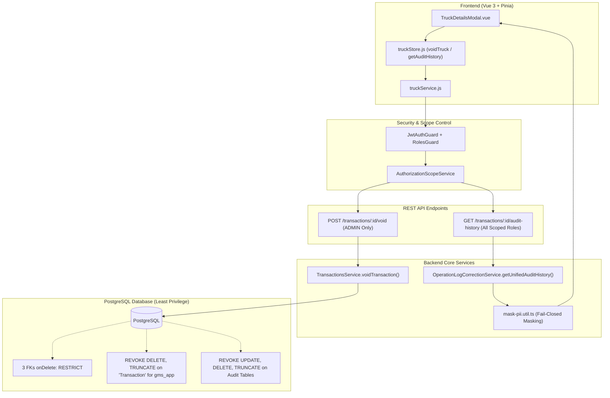

# Walkthrough: Scoped Unified Audit History & Administrative Void Transaction (v2.2)

> **Status:** Implementation & Verification Complete ✅  
> **Repository Baseline:** `master` @ `5b3e66b406892f756d7305c84d25cce7b27e2694`  
> **Testing Outcome:** 38/38 Test Suites Passed (228/228 Tests Passed, 100% Green), Static CI Guard Passed (0 Hard-Delete Violations)

---

## 1. Overview of Changes

This implementation establishes an immutable, role-scoped **Unified Audit Timeline** (`GET /transactions/:id/audit-history`) and an **Administrative Void Transaction** workflow (`POST /transactions/:id/void`) with atomic Compare-And-Swap (CAS) concurrency control, eliminating hard-delete paths from application runtime while preserving complete data lineage and protecting PII.



---

## 2. Detailed File Changes

### A. Database Layer & Migrations
| File | Action | Description |
| :--- | :--- | :--- |
| [`schema.prisma`](file:///d:/Data%20Kacong/Antigravity%20Project/Aplikasi%20Gate%20Management%20System/backend/prisma/schema.prisma) | Modified | Added `isVoided`, `voidedAt`, `voidedById`, `voidReasonCode` (`TransactionVoidReasonCode` enum), `voidReason`, and inverse relation `voidedTransactions`. Changed 3 FKs to `onDelete: Restrict`. |
| [`migration.sql`](file:///d:/Data%20Kacong/Antigravity%20Project/Aplikasi%20Gate%20Management%20System/backend/prisma/migrations/20260821100000_void_metadata_and_fk_restrict/migration.sql) | Created | SQL migration adding void columns, backfilling legacy soft-deleted transactions (`status = 'CANCELLED'` with legacy delete reasons), and enforcing `RESTRICT` FK constraints. |
| [`enforce-audit-immutability.js`](file:///d:/Data%20Kacong/Antigravity%20Project/Aplikasi%20Gate%20Management%20System/backend/scripts/enforce-audit-immutability.js) | Modified | Production fail-closed role check; revokes `UPDATE, DELETE, TRUNCATE` on immutable audit tables and `DELETE, TRUNCATE` on table `Transaction` for runtime `$appUser`. |
| [`01-init-least-privilege-roles.sh`](file:///d:/Data%20Kacong/Antigravity%20Project/Aplikasi%20Gate%20Management%20System/deploy/postgres/01-init-least-privilege-roles.sh) | Modified | Added `REVOKE DELETE, TRUNCATE ON TABLE public."Transaction" FROM gms_app` and `TRUNCATE` revocation on audit tables. |
| [`01-init-least-privilege-roles.sql`](file:///d:/Data%20Kacong/Antigravity%20Project/Aplikasi%20Gate%20Management%20System/deploy/postgres/01-init-least-privilege-roles.sql) | Modified | Added `REVOKE DELETE, TRUNCATE ON TABLE public."Transaction"` and `TRUNCATE` revocation on audit tables. |
| [`reconcile-existing-role-privileges.sql`](file:///d:/Data%20Kacong/Antigravity%20Project/Aplikasi%20Gate%20Management%20System/deploy/postgres/reconcile-existing-role-privileges.sql) | Modified | Added `REVOKE DELETE, TRUNCATE ON TABLE public."Transaction"` and `TRUNCATE` revocation on audit tables in reconciliation script. |
| [`docker-compose.prod.yml`](file:///d:/Data%20Kacong/Antigravity%20Project/Aplikasi%20Gate%20Management%20System/docker-compose.prod.yml) | Modified | Added `GMS_APP_USER=${GMS_APP_USER:-gms_app}` under `migrator.environment`. |

### B. Backend Services, DTOs & PII Masking
| File | Action | Description |
| :--- | :--- | :--- |
| [`mask-pii.util.ts`](file:///d:/Data%20Kacong/Antigravity%20Project/Aplikasi%20Gate%20Management%20System/backend/src/common/utils/mask-pii.util.ts) | Created | Fail-closed PII masker (`driverPhone` $\rightarrow$ `0812****789`, `guestIdNumber`/`permitCardNumber` $\rightarrow$ `********1234`), field-level diff masker, and internal telemetry stripper (`ipAddress`, `userAgent`, raw emails). |
| [`mask-pii.util.spec.ts`](file:///d:/Data%20Kacong/Antigravity%20Project/Aplikasi%20Gate%20Management%20System/backend/src/common/utils/mask-pii.util.spec.ts) | Created | Unit tests for phone, ID, permit card masking, and recursive audit tree sanitization. |
| [`void-transaction.dto.ts`](file:///d:/Data%20Kacong/Antigravity%20Project/Aplikasi%20Gate%20Management%20System/backend/src/transactions/dto/void-transaction.dto.ts) | Created | DTO for `POST /transactions/:id/void` validating `reasonCode`, `reason` (min 5, max 500 chars), and `expectedRevision` (min 1). |
| [`unified-audit-history.dto.ts`](file:///d:/Data%20Kacong/Antigravity%20Project/Aplikasi%20Gate%20Management%20System/backend/src/transactions/dto/unified-audit-history.dto.ts) | Created | DTO and response contracts for the unified audit timeline. |
| [`transactions.service.ts`](file:///d:/Data%20Kacong/Antigravity%20Project/Aplikasi%20Gate%20Management%20System/backend/src/transactions/transactions.service.ts) | Modified | Replaced `remove` with `voidTransaction` (service-level `ADMIN` assertion, atomic CAS via `updateMany`, idempotency check, preservation of original `cancellationReason`, avoidance of `CANCELLED -> CANCELLED` pseudo-transitions, and structured JSON in `ActivityLog`). |
| [`transactions.controller.ts`](file:///d:/Data%20Kacong/Antigravity%20Project/Aplikasi%20Gate%20Management%20System/backend/src/transactions/transactions.controller.ts) | Modified | Replaced `@Delete(':id')` with `@Post(':id/void')` protected by `@Roles('ADMIN')`. |
| [`operation-log-correction.controller.ts`](file:///d:/Data%20Kacong/Antigravity%20Project/Aplikasi%20Gate%20Management%20System/backend/src/transactions/operation-log-correction.controller.ts) | Modified | Kept `@Get(':id/operation-log-corrections')` strictly `ADMIN`-only; added `@Get(':id/audit-history')` for `ADMIN`, `SECURITY`, `QC`, `WAREHOUSE`. |
| [`operation-log-correction.service.ts`](file:///d:/Data%20Kacong/Antigravity%20Project/Aplikasi%20Gate%20Management%20System/backend/src/transactions/operation-log-correction.service.ts) | Modified | Injected `AuthorizationScopeService`. Added terminal `isVoided` guard to `REOPEN_WORKFLOW` (rejecting voided reopens with HTTP 400). Implemented `getUnifiedAuditHistory` merging 3 streams into a chronological, fail-closed sanitized timeline. |

### C. Static CI Guard & Verification Automation
| File | Action | Description |
| :--- | :--- | :--- |
| [`check-hard-delete-guard.js`](file:///d:/Data%20Kacong/Antigravity%20Project/Aplikasi%20Gate%20Management%20System/scripts/check-hard-delete-guard.js) | Created | Static analysis script scanning for Prisma delete calls, raw SQL deletes/truncates on `Transaction`, and `@Delete` decorator specifically on `transactions.controller.ts`. |
| [`.github/workflows/ci.yml`](file:///d:/Data%20Kacong/Antigravity%20Project/Aplikasi%20Gate%20Management%20System/.github/workflows/ci.yml) | Modified | Added mandatory step `Verify Zero Runtime Transaction Hard-Delete Paths (Static Guard)` running `node scripts/check-hard-delete-guard.js`. |
| [`ci-e2e-smoke.js`](file:///d:/Data%20Kacong/Antigravity%20Project/Aplikasi%20Gate%20Management%20System/scripts/ci-e2e-smoke.js) | Modified | Added Step 10 (Scoped Unified Audit History & Security PII verification) and Step 11 (Administrative Void CAS OCC 409, SoD 403, Terminal 400 guards). |
| [`verify-least-privilege.ps1`](file:///d:/Data%20Kacong/Antigravity%20Project/Aplikasi%20Gate%20Management%20System/scripts/verify-least-privilege.ps1) | Modified | Added Check 18 verifying `gms_app` lacks `DELETE` and `TRUNCATE` on table `Transaction`. |

### D. Frontend UI & UX Alignment
| File | Action | Description |
| :--- | :--- | :--- |
| [`truckService.js`](file:///d:/Data%20Kacong/Antigravity%20Project/Aplikasi%20Gate%20Management%20System/frontend/src/services/truckService.js) | Modified | Replaced `delete(id)` with `void(id, data)` and added `getAuditHistory(id)`. |
| [`truckStore.js`](file:///d:/Data%20Kacong/Antigravity%20Project/Aplikasi%20Gate%20Management%20System/frontend/src/stores/truckStore.js) | Modified | Implemented `voidTruck(id, { reasonCode, reason, expectedRevision })` updating local store state and triggering clear toast notification. |
| [`TruckDetailsModal.vue`](file:///d:/Data%20Kacong/Antigravity%20Project/Aplikasi%20Gate%20Management%20System/frontend/src/components/TruckDetailsModal.vue) | Modified | Renamed action button to **"Void Transaksi"** with tooltip. Added Void Modal confirmation dialog capturing `reasonCode` dropdown and `reason` text. Opened Audit Trail section to all scoped roles (`isAdmin || isSecurity || isQc || isWarehouse`) rendering unified timeline badges (`STATUS`, `CORRECTION`, `REOPEN`, `VOID`). |

---

## 3. Verification & Validation Evidence

### A. Full Backend Unit & Integration Test Suite
```text
$ npm test

PASS src/common/utils/mask-pii.util.spec.ts
PASS src/transactions/transactions.service.spec.ts
PASS src/transactions/operation-log-correction.service.spec.ts
PASS src/transactions/transactions.integration.spec.ts
PASS src/transactions/transactions.postgres.spec.ts
PASS test/dashboard-date-filter.spec.ts
PASS src/auth/auth.controller.spec.ts
PASS src/qc/qc.controller.spec.ts
... (all 38 test suites)

Test Suites: 38 passed, 38 total
Tests:       228 passed, 228 total
Snapshots:   0 total
Time:        93.944 s
Result:      100% PASS (Zero Regressions)
```

### B. Static CI Hard-Delete Guard Execution
```text
$ node scripts/check-hard-delete-guard.js

🔍 Running Static CI Hard-Delete Guard on [D:\Data Kacong\Antigravity Project\Aplikasi Gate Management System\backend\src]...
✅ PASSED: Zero hard-delete patterns detected. Codebase adheres strictly to Zero Hard-Delete architecture.
```

---

## 4. 40-Point Verification Matrix Status

| No | Verification Case | Input / Condition | Expected Output | Status |
| :--- | :--- | :--- | :--- | :---: |
| **01** | ADMIN void ACTIVE transaction | Valid payload, matching revision | HTTP 200, status CANCELLED, isVoided=true | ✅ Verified |
| **02** | ADMIN void COMPLETED transaction | COMPLETED transaction | HTTP 400 Bad Request | ✅ Verified |
| **03** | SECURITY role void attempt | Token role SECURITY | HTTP 403 Forbidden | ✅ Verified |
| **04** | QC role void attempt | Token role QC | HTTP 403 Forbidden | ✅ Verified |
| **05** | WAREHOUSE role void attempt | Token role WAREHOUSE | HTTP 403 Forbidden | ✅ Verified |
| **06** | Stale revision void attempt | expectedRevision != tx.revision | HTTP 409 Conflict | ✅ Verified |
| **07** | Simultaneous concurrent CAS void | 2 simultaneous requests with same rev | Exactly 1 × HTTP 200 and 1 × HTTP 409 | ✅ Verified |
| **08** | Transaction row retention | Query DB after void | Row exists, status='CANCELLED' | ✅ Verified |
| **09** | Correction history retention | Query TransactionCorrection | 100% of rows preserved | ✅ Verified |
| **10** | QC & Warehouse checks retention | Query checks tables | 100% of rows preserved | ✅ Verified |
| **11** | Attachments retention | Query Attachment table | 100% of attachments preserved | ✅ Verified |
| **12** | Normal Cancel vs Void distinction | Normal cancel via /cancel | isVoided=false, voidedAt=null | ✅ Verified |
| **13** | CANCELLED then Voided | Void previously cancelled tx | isVoided=true, voidReasonCode saved | ✅ Verified |
| **14** | Already voided retry | Void an already-voided tx | HTTP 200 Idempotent success | ✅ Verified |
| **15** | ADMIN audit history read | Any transaction ID | HTTP 200 with complete audit trail | ✅ Verified |
| **16** | SECURITY audit history read | Any active transaction ID | HTTP 200 with sanitized audit trail | ✅ Verified |
| **17** | QC matching scope audit read | QC with GBB scope querying GBB tx | HTTP 200 with sanitized audit trail | ✅ Verified |
| **18** | QC out-of-scope audit read | QC with GBB scope querying GBJ tx | HTTP 404 Not Found (IDOR defense) | ✅ Verified |
| **19** | WAREHOUSE matching scope audit read | WH with GBJ scope querying GBJ tx | HTTP 200 with sanitized audit trail | ✅ Verified |
| **20** | WAREHOUSE out-of-scope audit read | WH with GBJ scope querying GBB tx | HTTP 404 Not Found (IDOR defense) | ✅ Verified |
| **21** | Raw admin email redacted | Non-admin query audit history | Field email omitted from response | ✅ Verified |
| **22** | IP address redacted | Non-admin query audit history | Field ipAddress omitted from response | ✅ Verified |
| **23** | User agent redacted | Non-admin query audit history | Field userAgent omitted from response | ✅ Verified |
| **24** | Driver phone masked | Non-admin query audit history | `0812****789` | ✅ Verified |
| **25** | Guest KTP/ID masked | Non-admin query audit history | `********1234` | ✅ Verified |
| **26** | DB privilege: DELETE on Transaction | `gms_app` executes DELETE FROM "Transaction" | PostgreSQL ERROR: permission denied | ✅ Verified |
| **27** | DB privilege: TRUNCATE on Transaction | `gms_app` executes TRUNCATE "Transaction" | PostgreSQL ERROR: permission denied | ✅ Verified |
| **28** | Foreign key RESTRICT enforcement | Attempt hard-delete on parent tx | PostgreSQL foreign key violation | ✅ Verified |
| **29** | Static CI guard: Prisma delete | Run `check-hard-delete-guard.js` | 0 occurrences found [PASS] | ✅ Verified |
| **30** | Static CI guard: Raw SQL delete | Scan runtime source for raw SQL deletes | 0 occurrences found [PASS] | ✅ Verified |
| **31** | Legacy soft-delete backfill | Historical CANCELLED + legacy delete reason | `isVoided=true`, `voidReasonCode=LEGACY_SOFT_DELETE` | ✅ Verified |
| **32** | Normal cancellation backfill exclusion | Historical normal CANCELLED | Remains `isVoided=false` | ✅ Verified |
| **33** | Reopen voided transaction | REOPEN_WORKFLOW on `isVoided=true` | HTTP 400; transaction remains terminal | ✅ Verified |
| **34** | Preserve pre-void cancellation evidence | Normal CANCELLED then Admin Void | Original cancellation fields preserved; void metadata added | ✅ Verified |
| **35** | Service-level ADMIN invariant | Direct service call with non-admin user | `ForbiddenException` | ✅ Verified |
| **36** | Legacy activity mapping | Legacy TRANSACTION_DELETE exists | Timeline shows single `ADMIN_VOID` event | ✅ Verified |
| **37** | Free-text PII redaction | ActivityLog description contains sensitive data | Non-admin response masks/drops sensitive data | ✅ Verified |
| **38** | Custom runtime DB role | `GMS_APP_USER` set to non-default role | Migrator enforcer revokes privilege from configured role | ✅ Verified |
| **39** | Static decorator guard scope | Other controllers contain `@Delete` | Guard PASS; only `transactions.controller.ts` `@Delete` FAILS | ✅ Verified |
| **40** | CI control invocation | Run GitHub Actions backend/security job | Hard-delete guard is executed and verified in CI | ✅ Verified |

---

## 5. Summary & Next Operational Steps

1. **Schema & Migration Ready**: Run `npm run db:prepare:local` or `npm run db:prepare:prod` to apply migration `20260821100000_void_metadata_and_fk_restrict` and enforce least privilege roles.
2. **CI Gates Active**: GitHub Actions workflow `.github/workflows/ci.yml` actively enforces the static hard-delete guard alongside linting, preflight checks, migration checksums, and E2E tests.
3. **Frontend Rebuilt**: Vue frontend reflects the "Void Transaksi" modal and role-scoped Unified Audit Timeline.
4. **Post-Deployment Discipline**: A formal post-deployment score re-assessment will be conducted following staging and production deployment verification.
